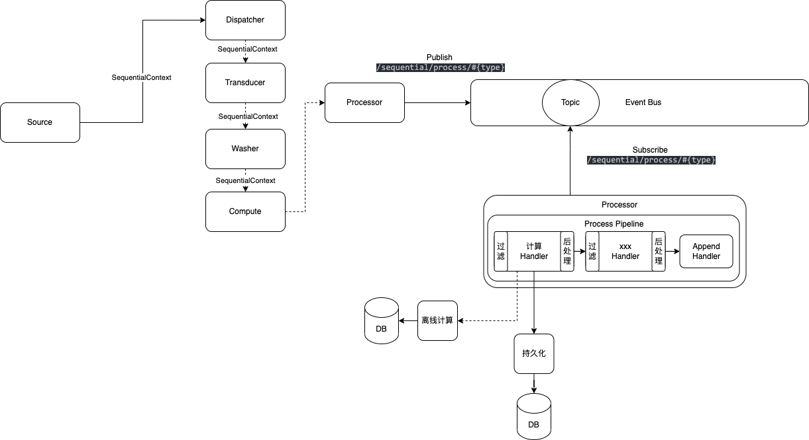

时序数据必然是一个大数据量，多端推送（物联网、大数据等），所以就必然涉及到高并发相关的问题。 高并发主要矛盾就是有限的资源对应大量的请求，所以在接收端主要采用MQ对数据暂存+择机处理，少部分采用HTTP Endpoint进行接收。 数据处理链路采用响应式编程，异步非阻塞的实现，达到高性能目的。

在上图中，时序数据的处理分为如下组件：

- `Source`：数据源端，该端由[uno-core](../core.html)的 **metadata**支持，可以包含kafka、http等数据源端
- `Dispatcher`：数据派发端，通过上游数据源转发至下游节点组件进行处理
- `Transducer`：数据转换，把某一个数据指标转换为另外一个指标
- `Washer`：数据清洗，根据给定的规则执行清洗，对于过滤的数据使用[uno-data](../data.html)存放至指定数据系统中
- `Compute`：数据计算，可以执行实时计算。
- `Processor`：数据处理，通过事件总线处理某类时序数据，在处理过程中包含处理链流水线，可以包含触发离线计算，与数据持久化。
  - `ProcessHandler`：处理器，包含生命周期，即初始化、预处理、处理、后处理、销毁。
  - `ProcessPipeline`：组织`ProcessHandler`为处理器链路。
  - `AppendProcessHandler`：追加于处理器最后，做多处理。

