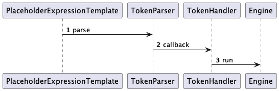
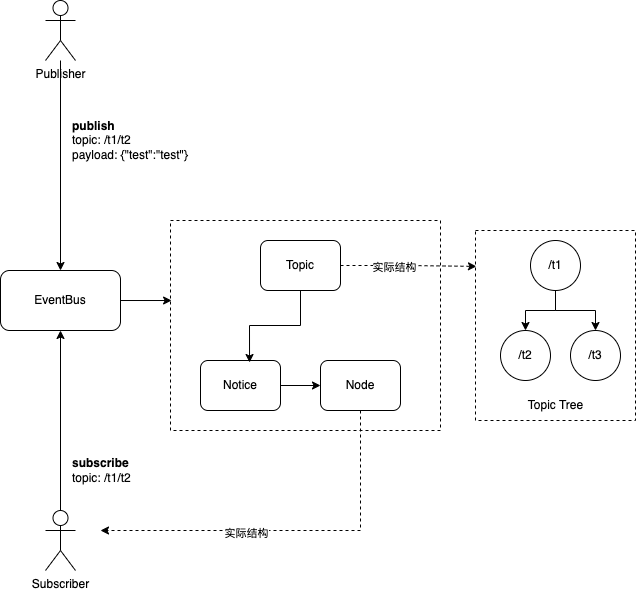
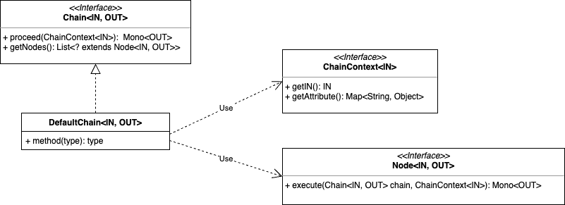

## 1 工具集

### 1.2 字符串工具集 StringUtils

```java
public class StringUtils extends org.springframework.util.StringUtils 
```

在类的签名上继承于spring的`StringUtils`，所以该类包含基本的`isEmpty()`、`concatenateStringArrays()`等方法。下面介绍再其上新添加的方法:


#### 1.2.1 cropUrl

裁剪带有请求参数的url。

```java
  /**
   * 裁剪带有请求参数的url。<br/>
   * example：https://passport.baidu.com/passApi/js/wrapper.js?cdnversion=1638804235178&_=1638804234866<br/>
   * or<br/>
   * https://passport.baidu.com/passApi/{id}/{name}<br/>
   * <b>给定规则：</b><br/>
   * <i>1.请求链接中如果存在带有"?"并且后面跟有参数，那么把"url"裁剪成http://localhost/api, 其余的参数通过sink或者consumer进行消费</i><br/>
   * <i>2.请求链接中入股存在"{id}"的占位符格式，那么保留这个url。"id"这个参数通过sink或者consumer进行消费</i><br/>
   * <i>3.请求链接同时存在"?"与"{id}", 那么按照1与2的规则进行裁剪</i>
   *
   * @param url 请求url
   * @return 裁剪完没有带请求的地址
   */
  public static String cropUrl(String url, FluxSink<Tuple2<String, List<String>>> sink) {
      ...
  }
```

使用示例：

```java
/**
 * 测试裁剪时发送参数
 */
@Test
void testCuttingEmitterParameter() {
    String url = "https://ss0.baidu.com/6ONWsjip0QIZ8tyhnq/it/u=271657503,3457309198&fm=179&app=35&f=PNG?w=96";
    AtomicReference<FluxSink<Tuple2<String, List<String>>>> emitter = new AtomicReference<>();
    Flux.create(emitter::set)
            .subscribe(tuple2 -> {
                assertEquals("w", tuple2.getT1());
                assertEquals("96", tuple2.getT2().get(0));
            });
    StringUtils.cropUrl(url, emitter.get());
}
```


#### 1.2.2 joinUrl

在url中拼接参数。

```java
/**
 * 向url链接中拼接vars的内容<br/>
 * example：https://passport.baidu.com/passApi/js/wrapper.js?cdnversion=1638804235178&_=1638804234866<br/>
 * or<br/>
 * https://passport.baidu.com/passApi/{id}/{name}<br/>
 * <b>拼接分为两部分：</b><br/>
 * <i>1.占位符替换</i><br/>
 * <i>2.参数的拼接</i>
 *
 * @param templateUrl 模板url链接
 * @param vars        参数Map集合
 * @return 拼接完成后的url地址
 * @throws IllegalArgumentException 参数为空时抛出异常
 */
public static String joinUrl(String templateUrl, Map<String, ?> vars) {
  ...
}
```

使用示例：

```java
/**
 * 测试拼接多个参数
 */
@Test
void testJoinMultiParameter() {
    String url = "https://www.json.cn/index.php";
    Map<String, String> vars = new HashMap<>();
    vars.put("s", "api");
    vars.put("app", "blog");
    vars.put("c", "tran");
    vars.put("m", "get_user_status");
    String joinUrl = StringUtils.joinUrl(url, vars);
    assertEquals("https://www.json.cn/index.php?app=blog&s=api&c=tran&m=get_user_status", joinUrl);
}
```

#### 1.2.3 getBaseUrl

```java
/**
 * 获取url中基础的地址<br/>
 * example: https://passport.baidu.com/passApi/js/wrapper.js?cdnversion=1638804235178&_=1638804234866<br/>
 * result：passport.baidu.com
 *
 * @param templateUrl 请求链接
 * @return 解析完成的地址
 */
public static Mono<String> getBaseUrl(String templateUrl) {
  ...
}
```

#### 1.2.4 getApiUrl

```java
/**
 * 获取url中api的地址
 * example: https://passport.baidu.com/passApi/js/wrapper.js<br/>
 * result：/passApi/js/wrapper.js
 *
 * @param templateUrl 请求链接
 * @return 解析完成的地址
 */
public static Mono<String> getApiUrl(String templateUrl) {
	...
}
```

#### 1.2.5 getHost

```java
/**
 * 获取url中主机地址<br/>
 * example: passport.baidu.com:8080
 * result: passport.baidu.com
 *
 * @param templateUrl 请求链接
 * @return 解析完成的地址
 */
public static Mono<String> getHost(String templateUrl) {
	...
}
```

#### 1.2.6 getPort

```java
/**
 * 获取url中主机端口<br/>
 * example: passport.baidu.com:8080
 * result: 8080
 *
 * @param templateUrl 请求链接
 * @return 解析完成的端口
 */
public static Mono<Integer> getPort(String templateUrl) {
  ...
}
```

### 1.3 ResourceUtils

用于类路径下资源的加载于解析，基于spring`ResourceUtils`

### 1.4 Requires

关于方法参数验证的类，如果要验证不通过将抛出一个统一的异常。

### 1.5 反射 ReflectUtils

### 1.6 ObjectUtils

### 1.7 NumberUtils

### 1.8 JsonUtils

### 1.9 IoUtils

### 1.10 FileUtils

### 1.11 DateUtil

### 1.12 CoreBeanUtil

Spring Bean工具方法

### 1.13 ConvertUtil

### 1.14 CollectionUtils

### 1.15 ClassUtils

### 1.16 CalendarUtil

### 1.17 BigDecimalUtil

### 1.18 template

在实际字符串解析过程，常常会有模板占位符的替换，如mybatis的xml编写，SpEL表达式的编写。基于这种需求在template包下包含以模板表达式的解析。

```java
public interface ExpressionTemplate {

    /**
     * Express模板文件的后缀
     */
    String FILE_SUFFIX = ".template";

    /**
     * 解析模板，当发生错误时将保持原样
     *
     * @param template 模板
     * @param target   填充于模版的目标对象，要求是一个POJO对象
     * @return 解析完成的字符串
     * @throws NullPointerException template target为空时抛出
     */
    String parseTemplate(String template, Object target);

  	// 方法省略
		...
}
```

在`ExpressionTemplate`接口中，定义了模板解析的模板方法，通过传入指定的模板字符串和对应用于解析的对象（可能是POJO、Map、List...）。


TokenParser：通过把文本逐个翻译成字节后与给定的`Tokenizer`比较，如果匹配则调用`TokenHandler`做进一步处理，在`PlaceholderExpressionTemplate`中：

```java
public class PlaceholderExpressionTemplate implements ExpressionTemplate {

    private final TokenParser tokenParser;
    private final Engine engine;
    private final boolean langsym;

    PlaceholderExpressionTemplate(Tokenizer tokenizer) {
        this(tokenizer, false);
    }

    PlaceholderExpressionTemplate(Tokenizer tokenizer, boolean langsym) {
        this.tokenParser = new GenericTokenParser(tokenizer);
        this.engine = new SymbolEngine(StringPool.DOT);
        this.langsym = langsym;
    }

    @Override
    public String parseTemplate(@NonNull String template, @NonNull Object target) {
        return tokenParser.parse(template, expression -> {
            try {
                return engine.run(expression, target, langsym);
            } catch (Throwable e) {
                return expression;
            }
        });
    }

}
```

经过回调调用`Engine`做进一步处理。





使用示例：

```java
@Override
protected void onInit() throws Throwable {
    template = new PlaceholderExpressionTemplate(Tokenizer.HASH_BRACE);
    user = new User();
    user.setId("1");
    System system = new System();
    system.setId("2");
    user.setSystem(system);
}

@Test
void testPlainText() {
    String plain = "#{id} - #{system.id}";
    String r = template.parseTemplate(plain, user);
    assertEquals("1 - 2", r);
}
```

### 1.19 id

在系统常用需要生成唯一id，在core中有通用工具类：`IdGenerator`

```java
Long nextId = IdGenerator.defaultGenerator().getNextId();
```

## 2 事件总线

事件总线基于主题（Topic）-发布（Publish）-订阅（Subscribe）模式，其中传播模型通过`Topic-Notic-Event`进行绑定。包含以下几个组件：

- 发布者（Publisher）：发布事件（数据）到事件总线上，使得订阅者（Subscriber）能够接受数据。
- 订阅者（Subscriber）：订阅者通过订阅自己感兴趣的事件，当事件到来时触发相应的动作。
- 事件（Event）：事件是一个抽象的模型，表明系统中存在的状态、动作的变化。
- 主题（Topic）：发布者与订阅者之间的联系，主题路径以'/'的形式（如/t1/t2）构成一颗主题树,支持通配符形式（如/t1/**），当发布者向`/t1/t2`发布事件，订阅者`/t1/**`就能收到该事件。
- Node：订阅者的模型。
- Notic：从Topic连接到Node之间的桥梁组件。




下面为`EventBus`Api定义：

```java
public interface EventBus<C extends EventContext> {

    /**
     * 根据主题路径获取指定的主题实例
     *
     * @param topicKey topicKey
     * @return Topic stream or empty stream
     */
    default Flux<Topic<C>> findTopic(TopicKey topicKey) {
        return findTopic(topicKey.getSubscription());
    }

    /**
     * 根据主题路径获取指定的主题实例
     *
     * @param path 主题路径
     * @return Topic stream or empty stream
     */
    default Flux<Topic<C>> findTopic(String path) {
        return findTopic(Subscription.of(path));
    }

    /**
     * 根据主题路径获取指定的主题实例
     *
     * @param subscription 订阅实例
     * @return Topic stream or empty stream
     */
    Flux<Topic<C>> findTopic(Subscription subscription);

    /**
     * 批量订阅事件总线
     *
     * @param subscriptions 订阅集合
     * @return 多源的数据流
     * @see #subscribe(Subscription)
     */
    default Flux<Node<C>> subscribe(List<Subscription> subscriptions) {
        return Flux.fromIterable(subscriptions).flatMap(this::subscribe);
    }

    /**
     * 订阅该事件总线，如果没有生成{@link Topic}将会先生成Topic。
     * <b>不支持重复订阅，第一次订阅时返回流数据，后面针对同一个订阅都是空流</b>
     *
     * @param path 主题（可以是通配符/test/*，订阅test下所有主题）
     * @return 返回指定Topic下新的Node实例
     */
    default Flux<Node<C>> subscribe(String path) {
        return subscribe(Subscription.of(path));
    }

    /**
     * 订阅该事件总线，如果没有生成{@link Topic}将会先生成Topic。
     * <b>不支持重复订阅，第一次订阅时返回流数据，后面针对同一个订阅都是空流</b>
     *
     * @param topicEvent 主题事件（可以是通配符/test/*，订阅test下所有主题）
     * @return 返回指定Topic下新的Node实例
     */
    default Flux<Node<C>> subscribe(TopicEvent topicEvent) {
        return subscribe(topicEvent.getTopicKey().getSubscription());
    }

    /**
     * 订阅该事件总线，如果没有生成{@link Topic}将会先生成Topic。
     * <b>不支持重复订阅，第一次订阅时返回流数据，后面针对同一个订阅都是空流</b>
     *
     * @param subscription 订阅消息
     * @return 返回指定Topic下新的Node实例
     * @see #subscribeOnRepeatable(Subscription)
     */
    Flux<Node<C>> subscribe(Subscription subscription);

    /**
     * 订阅该事件总线，如果没有生成{@link Topic}将会先生成Topic。
     * <b>支持重复订阅</b>
     *
     * @param subscriptions 订阅集合
     * @return node stream
     */
    default Flux<Node<C>> subscribeOnRepeatable(List<Subscription> subscriptions) {
        return Flux.fromIterable(subscriptions).flatMap(this::subscribeOnRepeatable);
    }

    /**
     * 订阅该事件总线，如果没有生成{@link Topic}将会先生成Topic。
     * <b>支持重复订阅</b>
     *
     * @param path 主题路径
     * @return node stream
     */
    default Flux<Node<C>> subscribeOnRepeatable(String path) {
        return subscribeOnRepeatable(Subscription.of(path));
    }

    /**
     * 订阅该事件总线，如果没有生成{@link Topic}将会先生成Topic。
     * <b>支持重复订阅</b>
     *
     * @param topicEvent 主题事件
     * @return node stream
     */
    default Flux<Node<C>> subscribeOnRepeatable(TopicEvent topicEvent) {
        return subscribeOnRepeatable(topicEvent.getTopicKey());
    }

    /**
     * 订阅该事件总线，如果没有生成{@link Topic}将会先生成Topic。
     * <b>支持重复订阅</b>
     *
     * @param topicKey 主题键
     * @return node stream
     */
    default Flux<Node<C>> subscribeOnRepeatable(TopicKey topicKey) {
        return subscribeOnRepeatable(topicKey.getSubscription());
    }

    /**
     * 订阅该事件总线，如果没有生成{@link Topic}将会先生成Topic。
     * <b>支持重复订阅</b>
     *
     * @param subscription 订阅消息
     * @return node stream
     */
    Flux<Node<C>> subscribeOnRepeatable(Subscription subscription);

    /**
     * 向消息指定{@link Topic}解除当前{@link Node}。<br/>
     * {@link Node#doLift(LongConsumer)}}事件
     *
     * @param listenerId 监听id
     * @param topicKey   topicKey
     */
    default void unSubscribe(Long listenerId, TopicKey topicKey) {
        unSubscribe(listenerId, topicKey.getPath());
    }

    /**
     * 向消息指定{@link Topic}解除当前{@link Node}。<br/>
     * {@link Node#doLift(LongConsumer)}}事件
     *
     * @param listenerId 监听id
     * @param topic      消息主题
     */
    void unSubscribe(Long listenerId, String topic);

    /**
     * 从事件总线释放指定的topic
     *
     * @param topicKey topic唯一标识
     */
    default void releaseTopic(TopicKey topicKey) {
        releaseTopic(topicKey.getPath());
    }

    /**
     * 从事件总线释放指定的topic
     *
     * @param topic topic唯一标识
     */
    void releaseTopic(String topic);

    /**
     * 同一个上下文，批量发布数据
     *
     * @param subscriptions 订阅信息集合
     * @param context       时序上下文
     * @see #publish(Subscription, C)
     */
    default void publish(List<Subscription> subscriptions, C context) {
        subscriptions.forEach(subscription -> publish(subscription, context));
    }

    /**
     * 向事件总线发布数据，数据将会在当前路径Topic中所有{@link Node#doEmmit(Consumer)}被接受
     *
     * @param subscription 订阅信息数据
     * @param context      主题上下文
     */
    default void publish(Subscription subscription, C context) {
        publish(subscription.getPath(), context);
    }

    /**
     * 向事件总线发布数据，数据将会在当前路径Topic中所有{@link Node#doEmmit(Consumer)}被接受
     *
     * @param topicEvent topicEvent
     */
    default void publish(TopicEvent topicEvent) {
        topicEvent.getEventContext().getEventTracer().push(topicEvent);
        publish(topicEvent.getTopicKey().getPath(), (C) topicEvent.getEventContext());
    }

    /**
     * 向事件总线发布数据，数据将会在当前路径Topic中所有{@link Node#doEmmit(Consumer)}被接受
     *
     * @param path    订阅主题路径
     * @param context 主题上下文
     */
    default void publish(String path, C context) {
        publishOnFlux(path, context).subscribe();
    }

    /**
     * 向事件总线发布数据，数据将会在当前路径Topic中所有{@link Node#doEmmit(Consumer)}被接受
     *
     * @param topicEvent topicEvent
     */
    default Flux<Topic<C>> publishOnFlux(TopicEvent topicEvent) {
        topicEvent.getEventContext().getEventTracer().push(topicEvent);
        return publishOnFlux(topicEvent.getTopicKey().getPath(), (C) topicEvent.getEventContext());
    }

    /**
     * 批量向事件总线发布数据，数据将会在当前路径Topic中所有{@link Node#doEmmit(Consumer)}被接受
     *
     * @param topicEvents topicEvents
     * @return Topic - flux
     */
    default Flux<Topic<C>> publishOnFluxForMulti(List<TopicEvent> topicEvents) {
        return Flux.fromIterable(topicEvents)
                .flatMap(this::publishOnFlux)
                .distinct();
    }

    /**
     * 向事件总线发布数据，数据将会在当前路径Topic中所有{@link Node#doEmmit(Consumer)}被接受
     *
     * @param path    订阅主题路径
     * @param context 主题上下文
     * @return flux
     */
    Flux<Topic<C>> publishOnFlux(String path, C context);

    /**
     * 先进行订阅之后发布数据
     *
     * @param topicEvent topicEvent
     * @return Topic - flux
     */
    default Flux<Topic<C>> subThenPub(TopicEvent topicEvent) {
        subscribeOnRepeatable(topicEvent).subscribe();
        return publishOnFlux(topicEvent);
    }
}
```

### 2.1 基本使用

#EventBusTest.java

```java
private final EventBus<EventContext> bus = new DefaultEventBus();

@Test
void testSubscribe() {
    // 获取订阅的node
    bus.subscribe(Subscription.of("1"))
            .map(node -> node.reply(EmitEvent.class, eventContext -> assertEquals("1", eventContext.getTopicPath())))
            .as(StepVerifier::create)
            .expectNextCount(1)
            .verifyComplete();

    // 转换为 event context
    bus.subscribe(Subscription.of("1"))
            .flatMap(Node::onNext)
            .doOnNext(System.out::println)
            .subscribe();

    bus.subscribe(Subscription.of("2"))
            .map(node -> node.reply(EmitEvent.class, eventContext -> assertEquals("2", eventContext.getTopicPath())))
            .as(StepVerifier::create)
            .expectNextCount(1)
            .verifyComplete();

    bus.publish(Subscription.of("1"), new DefaultEventContext(Collections.emptyMap()));
    bus.publish(Subscription.of("2"), new DefaultEventContext(Collections.emptyMap()));
}

 @Test
void testWildcard() {
    bus.subscribe(Subscription.of("/t1/**"))
            .map(node -> node.reply(EmitEvent.class, eventContext -> System.out.println(eventContext.getTopicPath())))
            .as(StepVerifier::create)
            .expectNextCount(1)
            .verifyComplete();

    bus.subscribe(Subscription.of("/t2/**"))
            .map(node -> node.reply(EmitEvent.class, eventContext -> System.out.println(eventContext.getTopicPath())))
            .as(StepVerifier::create)
            .expectNextCount(1)
            .verifyComplete();

    bus.publish(Subscription.of("/t1/t2"), new DefaultEventContext(Collections.emptyMap()));
    bus.publish(Subscription.of("/t1/t2/t3"), new DefaultEventContext(Collections.emptyMap()));


    bus.publish(Subscription.of("/t2/t1/t3"), new DefaultEventContext(Collections.emptyMap()));

    bus.publish(Subscription.of("/t2/t1/t3"), new DefaultEventContext(Collections.emptyMap()));
}
```

## 3.元数据转换

对于一个结构化数据，不论是一个对象还是json数据，都含有其标准的格式。

```json
{
  "k1":"v1"
}
```

```java
public class Demo {
  private String id;
  ...
}
```

利用这个格式我们就可以对他进行描述，如类的字段名与他的值，json数据的key与他的值...利用这个特性可以通过对描述的数据进行搜集、转换为另一种数据...


在如上面的简易类图中，我们可以看到它怎么描述元数据，以及其定义和元数据字段的定义。在图的右侧部分，则是它进行数据搜集，转换以及下游处理的过程。通过`Endpoint`这个桥接器，连接了`Source`、`SourceCollector`、`SourceConverter`三者。

简单示例：

#DefaultEndpointTest.java

```java
@Test
void testCollect() {

    DefaultEndpoint<UserMetadata> endpoint = new DefaultEndpoint<>();
    TestSourceConverter converter = new TestSourceConverter();
    endpoint.setConverter(converter);
    TestSourceCollector collector = new TestSourceCollector();
    endpoint.setCollector(collector);

    // 设置数据源
    endpoint.registerSource(new CollectionSource(
            Lists.newArrayList(new User("id", "name", ""))));

    try {
        endpoint.open();
    } catch (Exception e) {
        throw new RuntimeException(e);
    }

    assertEquals(1, collector.size());
}
```

## 4.功能链

功能链本身不具备任何功能，它通过API来描述责任链模式，有三个角色：

1. `Chain`：责任链本身。
2. `Node`：在链中的节点.
3. `ChainContext`：执行过程的上下文。



在这个基础上，uno通过使用它完成了Http请求链的封装。

简单使用：

#DefaultChainTest.java

```java
@Test
void testNodeContext() throws Throwable {
    TestNode1 node1 = new TestNode1();
    TestNode2 node2 = new TestNode2();
    DefaultChain<String, String> chain = new DefaultChain<>(Arrays.asList(node2, node1));
    TestChainContext context = new TestChainContext();
    chain.proceed(context)
            .as(StepVerifier::create)
            .verifyComplete();
}
```

## 5.Task

