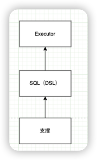
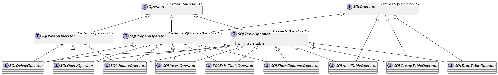
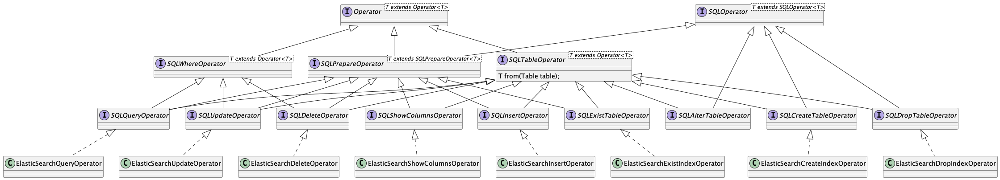
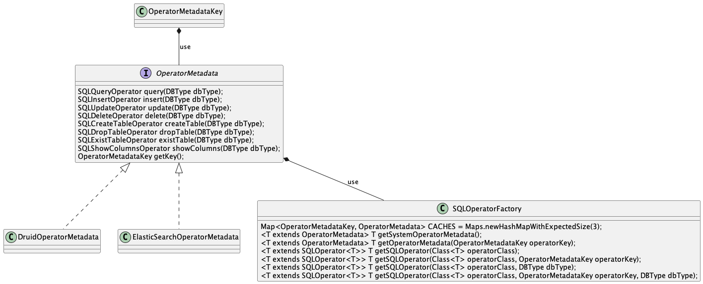
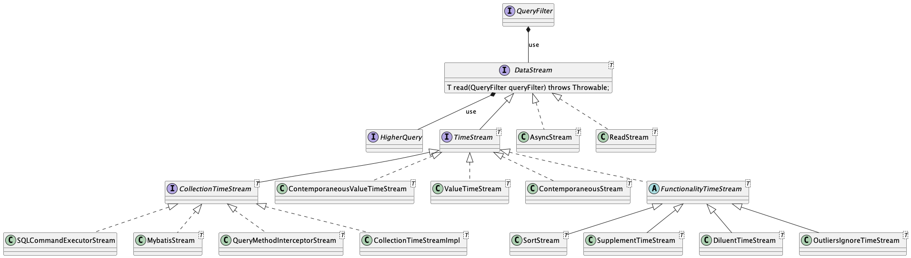

## 1.设计理念

uno-data是关于对'数据'进行封装、处理、方便使用为核心进行设计。想法是统一任何数据系统，使其使用的入口只有一个，适配于任意一个。对数据操作的本质在于CRUD，所以设计的核心在于打造一个统一的ORM框架。

目前已经适配：

- <font color="#006600">传统关系型数据库，MySQL、PostgreSQL、SQLServer...</font>
- <a href="https://www.elastic.co/"><font color="#006600">ElasticSearch</font></a>
- <a href="https://www.influxdata.com/"><font color="#696969">InfluxDB</font></a>
- <a href="https://redis.io/"><font color="#696969">Redis</font></a>
- <a href="https://www.mongodb.com/"><font color="#696969">MongoDB</font></a>
- <a href="https://neo4j.com/"><font color="#696969">Neo4j</font></a>
- <a href="https://tdengine.com/"><font color="#696969">TDEngine</font></a>


## 2.ORM设计

ORM设计分为SQL（或称做领域语言）、支撑（Type、Adapter）、Executor三部分组成。



- 支撑：为SQL层提供类型系统、以及构建的各种常量部分。
- SQL（DSL）：适配各个数据系统的CRUD语法为Executor层提供统一API。
- Executor：数据查询执行器。


### 2.1 SQL

为了适配所有的数据系统，关键的在于需要把API，与交互的关键类定义和组织。在SQL层面可以划分大的查询为两方面：DML、DDL，我们就可以依据这个划分，把整个设计分为两大块：

- 对数据处理的DML
- 对数据定义的DDL




如上图，是一套整体对'SQL'（即每个数据语言的自己的DSL部分，如数据库系统的SQL、ElasticSearch的Restful、influxdb的DSL...）定义的类图。可以粗浅的分为三层。

第一层是`Operator`、`SQLOperator`定义标识接口与SQL基础操作。

```java
public interface SQLOperator<T extends SQLOperator<T>> {

    /**
     * 获取SQL字符串
     *
     * @return SQL字符串
     */
    String getSQL();

    /**
     * 解析SQL
     *
     * @param sql sql
     * @return SQLOperator
     */
    T parse(String sql);

    /**
     * 重制当前SQL已经存在的数据
     */
    void reset();
}
```

第二层是公共接口的抽取，如查询、更新需要条件判断的`SQLWhereOperator`、数据预处理的`SQLPrepareOperator`...

第三层是对具体操作的定义：

- **SELECT ...** ==> `SQLQueryOperator`
- **UPDATE ...** ==> `SQLUpdateOperator`
- **DELETE ...** ==> `SQLDeleteOpeartor`
- **CREATE TABLE ...** ==> `SQLCreateTableOpeartor`
- ...

在这层面根据DML（如，`SQLQueryOperator`）、DDL（`SQLCreateTableOpeartor`）划分成不同的操作。

#### 2.1.1 Druid


在传统关系型数据库的适配采用Druid作为SQL语法解析为底层，为每一个DML、DDL进行解析。

如：
#QueryOperatorTest.java

```java
public class QueryOperatorTest extends BaseTestCase {

    @Test
    void testSelect() {
        DruidSQLQueryOperator operator = new DruidSQLQueryOperator(DBType.H2);
        String sql = operator.selectAll().getSQL();
        assertEquals("SELECT *", sql);
    }

    @Test
    void testFunc() {
        DruidSQLQueryOperator operator = new DruidSQLQueryOperator(DBType.H2);
        String sql = operator.select("z")
                .min("z")
                .getSQL();
        assertEquals("SELECT z, MIN(z)", sql);
    }

    @Test
    void testSimpleWhere() {
        DruidSQLQueryOperator operator = new DruidSQLQueryOperator(DBType.H2);
        String sql = operator.select("z").from("test").like("x", "zxc").getSQL();
        assertEquals("SELECT z\n" +
                "FROM test\n" +
                "WHERE x LIKE 'zxc'", sql);
    }

    @Test
    void testSubTable() {
        DruidSQLQueryOperator operator = new DruidSQLQueryOperator(DBType.H2);
        String sql = operator.leftJoin(Table.of("dual1"), Table.of("dual2"), SQLBinaryCondition.of("dual1.cc", "dual2.aa", TokenOperator.EQUALITY))
                .leftJoinThen("dual", "dual3", SQLBinaryCondition.of("dual.xx", "dual3.xx", TokenOperator.EQUALITY))
                .getSQL();
        assertEquals("SELECT \n" +
                "FROM (dual1\n" +
                "\tLEFT JOIN dual2 ON dual1.cc = dual2.aa) AS dual\n" +
                "\tLEFT JOIN dual3 dual3 ON dual.xx = dual3.xx", sql);
    }

    @Test
    void testOrder() {
        DruidSQLQueryOperator operator = new DruidSQLQueryOperator(DBType.H2);
        String sql = operator.select("a")
                .from("dual")
                .orderBy("a", OrderCondition.DESC)
                .getSQL();
        assertEquals("SELECT a\n" +
                "FROM dual\n" +
                "ORDER BY a DESC", sql);
    }

    @Test
    void testGroup() {
        DruidSQLQueryOperator operator = new DruidSQLQueryOperator(DBType.H2);
        String sql = operator.select("z")
                .from("dual")
                .groupByOne("z")
                .getSQL();
        assertEquals("SELECT z\n" +
                "FROM dual\n" +
                "GROUP BY z", sql);
    }

    @Test
    void testLimit() {
        DruidSQLQueryOperator operator = new DruidSQLQueryOperator(DBType.H2);
        String sql = operator.select("z")
                .from("dual")
                .page(1L, 10L)
                .getSQL();
        assertEquals("SELECT z\n" +
                "FROM dual\n" +
                "LIMIT 10, 0", sql);
    }
}
```

#DruidInsertOperatorTest.java

```java
public class DruidInsertOperatorTest extends BaseTestCase {

    @Test
    void testInsert() {
        DruidSQLInsertOperator insertOperator = new DruidSQLInsertOperator(DBType.H2);
        String sql = insertOperator.from("test")
                .insert("x", "2")
                .getSQL();
        assertEquals("INSERT INTO test (x)\n" +
                "VALUES ('2')", sql);
        insertOperator.reset();
        sql = insertOperator.
                from(User.class)
                .batchInsertPojos(Lists.newArrayList(new User("21", 2), new User("xc", 2)))
                .getSQL();
        assertEquals("INSERT INTO t_user (name, age)\n" +
                "VALUES ('21', 2), ('xc', 2)", sql);
    }

    @Test
    void testParse() {
        DruidSQLInsertOperator insertOperator = new DruidSQLInsertOperator(DBType.H2);

        insertOperator.parse("INSERT INTO t_user (name, age)\n" +
                "VALUES ('21', 2), ('xc', 2)");
        String sql = insertOperator.getSQL();
    }

    @Data
    @Table(name = "t_user")
    @AllArgsConstructor
    public static class User {
        private String name;
        private int age;
    }
}
```


#### 2.1.2 ElasticSearch



ElasticSearch作为搜索引擎，有他一套的DSL语法，它也提供了相应的DSL语法构建的客户端，所以在uno-data通过使用其提供的客户端适配当前的类型结构。使用的**es版本为7.17**。

#ElasticsearchQueryOperatorTest.java

```java
public class ElasticsearchQueryOperatorTest extends BaseTestCase {

    ElasticSearchQueryOperator queryOperator = new ElasticSearchQueryOperator();

    @BeforeEach
    public void setup() {
        queryOperator.reset();
    }

    @Test
    void testEQ() {
        String sql = queryOperator.eq("test", "1").from("bank").getSQL();
        assertEquals("{\"bool\":{\"must\":[{\"term\":{\"test\":{\"value\":\"1\"}}}]}}", sql);
    }

    @Test
    void testMatch() {
        String sql = queryOperator.like("test", "1").from("bank").getSQL();
        assertEquals("{\"bool\":{\"must\":[{\"match\":{\"test\":{\"query\":\"1\"}}}]}}", sql);
    }

    @Test
    void testGt() {
        String sql = queryOperator.gt("test", "1").from("bank").getSQL();
        assertEquals("{\"bool\":{\"must\":[{\"range\":{\"test\":{\"gt\":\"1\"}}}]}}", sql);
    }

    @Test
    void testLike$() {
        String sql = queryOperator.like$("test", "1").from("bank").getSQL();
        assertEquals("{\"bool\":{\"must\":[{\"wildcard\":{\"test\":{\"value\":\"1*\"}}}]}}", sql);
    }

    @Test
    void testAndOrAndNot() {
        String sql = queryOperator.like$("test", "1").from("bank").or().eq("t1", "2").getSQL();
        assertEquals("{\"bool\":{\"must\":[{\"wildcard\":{\"test\":{\"value\":\"1*\"}}}],\"should\":[{\"term\":{\"t1\":{\"value\":\"2\"}}}]}}", sql);
    }
}

```

#ElasticSearchInsertOperatorTest.java

```java
public class ElasticSearchInsertOperatorTest extends BaseTestCase {

    ElasticSearchInsertOperator operator = new ElasticSearchInsertOperator();

    @Test
    void testSingeInsert() {
        String sql = operator.from("test").insert("t1", "t2").getSQL();
        assertEquals("[{\"create\":{\"_id\":\"1112832259796238336\",\"_index\":\"test\"}}]", sql);
    }
}
```

#ElasticSearchUpdateOperatorTest.java

```java
public class ElasticSearchUpdateOperatorTest extends BaseTestCase {

    private final ElasticSearchUpdateOperator updateOperator = new ElasticSearchUpdateOperator();

    @Test
    void testUpdateForEQ() {
        Bank bank = JsonUtils.parse("{\n" +
                "          \"account_number\" : 37,\n" +
                "          \"balance\" : 18612,\n" +
                "          \"firstname\" : \"Mcgee\",\n" +
                "          \"lastname\" : \"Mooney\",\n" +
                "          \"age\" : 39,\n" +
                "          \"gender\" : \"M\",\n" +
                "          \"address\" : \"826 Fillmore Place\",\n" +
                "          \"employer\" : \"Reversus\",\n" +
                "          \"email\" : \"mcgeemooney@reversus.com\",\n" +
                "          \"city\" : \"Tooleville\",\n" +
                "          \"state\" : \"OK\"\n" +
                "        }", Bank.class);
        bank.setAge(33);
        String sql = updateOperator.from("bank").eq(Bank::getFirstname, "firstname").updatePojo(bank).getSQL();
        assertEquals("{\"query\":{\"bool\":{\"must\":[{\"match\":{\"firstname\":{\"query\":\"firstname\"}}}]}},\"script\":{\"params\":{\"firstname\":\"Mcgee\",\"address\":\"826 Fillmore Place\",\"gender\":\"M\",\"balance\":18612,\"city\":\"Tooleville\",\"employer\":\"Reversus\",\"state\":\"OK\",\"accountNumber\":0,\"email\":\"mcgeemooney@reversus.com\",\"age\":33,\"lastname\":\"Mooney\"},\"source\":\"ctx._source['city'] = params['city'];ctx._source['accountNumber'] = params['accountNumber'];ctx._source['lastname'] = params['lastname'];ctx._source['state'] = params['state'];ctx._source['firstname'] = params['firstname'];ctx._source['address'] = params['address'];ctx._source['balance'] = params['balance'];ctx._source['employer'] = params['employer'];ctx._source['gender'] = params['gender'];ctx._source['age'] = params['age'];ctx._source['email'] = params['email']\"}}", sql);
    }
}
```

#### 2.1.3 OperatorMetadata

`OperatorMetadata`为各个数据系统的操作做出元数据管理，根据`OpeartorMetadataKey`的标识各个数据系统，由`SQLOpeartorFactory`获取对应数据系统的`OperatorMetadata`实例。



#OperatorMetadataTest.java

```java
public class OperatorMetadataTest extends BaseTestCase {

    @Test
    void testTypeOfDataCorrectness() {
        OperatorMetadata drOperator = SQLOperatorFactory.getOperatorMetadata(OperatorMetadata.DRUID_OPERATOR_KEY);
        assertTrue(DruidOperatorMetadata.class.isAssignableFrom(drOperator.getClass()));
        OperatorMetadata esOperator = SQLOperatorFactory.getOperatorMetadata(OperatorMetadata.ELASTIC_SEARCH_KEY);
        assertTrue(ElasticSearchOperatorMetadata.class.isAssignableFrom(esOperator.getClass()));
    }
}
```

### 2.2 支撑


为保证上层体系的构建，在支撑的处理需要基础对象与数据的提供，这包括：

- `SQLType`
- `JavaType`
- `DbType`
- `Table`
- `SQLName`
- ...

### 2.3 Executor


执行器所处理的接收SQL、支撑层传递的数据对象与基础数据构建出不同数据系统的执行部分，如关系型数据库的使用`Mybatis`作为执行器，`ElasticSearch`使用`ES`提供的原生客户端。在执行器层面可以划分几个小的模块：

- 执行器
- 结果处理器
- 结果集

#### 2.3.1 SQLCommandExecutor

`SQLCommandExecutor`定义了数据操作，再结合`lambda`与`stream`提供了一套易于操作的API。可以划分为：

- crateTable：

  ```java
    /**
     * 根据pojo class创建表
     *
     * @param pojoClass the pojoClass
     * @return true 成功 false 失败
     */
    default <P> boolean createTable(Class<P> pojoClass) {
        PojoWrapper<P> pojoWrapper = new PojoWrapper<>(pojoClass);
        return createTable(o -> o.from(pojoWrapper.getTable()).columns(pojoWrapper.getSQLColumnDef()));
    }
  
    /**
     * 创表
     *
     * @param func the func
     * @return true 成功 false 失败
     */
    default boolean createTable(UnaryOperator<SQLCreateTableOperator> func) {
        return createTable(func.apply(getOperatorMetadata().createTable()));
    }
  
    /**
     * 创表
     *
     * @param createTableOperator SQLCreateTableOperator
     * @return true 成功 false 失败
     */
    default boolean createTable(SQLCreateTableOperator createTableOperator) {
        return bool(createTableOperator, SQLCommandType.CREATE_TABLE);
    }
  
    /**
     * 创表
     *
     * @param createTableOperator SQLCreateTableOperator
     * @param resultSetHandler    resultSetHandler
     * @return true 成功 false 失败
     */
    default boolean createTable(SQLCreateTableOperator createTableOperator, ResultSetHandler<Boolean> resultSetHandler) {
        return bool(createTableOperator, SQLCommandType.CREATE_TABLE, resultSetHandler);
    }
  ```

  使用如：

  ```java
  sqlExecutor.createTable(f -> f.from("xx"));
  ```

- dropTable：

  ```java
  
    /**
     * 根据pojo class删除表
     *
     * @param tableName the tableName
     * @return true 成功 false 失败
     */
    default boolean dropTable(String tableName) {
        return dropTable(o -> o.from(tableName));
    }
  
    /**
     * 根据pojo class删除表
     *
     * @param table the table
     * @return true 成功 false 失败
     */
    default boolean dropTable(Table table) {
        return dropTable(o -> o.from(table));
    }
  
    /**
     * 根据pojo class删除表
     *
     * @param pojoClass the pojoClass
     * @return true 成功 false 失败
     */
    default <P> boolean dropTable(Class<P> pojoClass) {
        PojoWrapper<P> pojoWrapper = new PojoWrapper<>(pojoClass);
        return dropTable(o -> o.from(pojoWrapper.getTable()));
    }
  
    /**
     * 删表
     *
     * @param func func
     * @return true 成功 false 失败
     */
    default boolean dropTable(UnaryOperator<SQLDropTableOperator> func) {
        return dropTable(func.apply(getOperatorMetadata().dropTable()));
    }
  
    /**
     * 删表
     *
     * @param dropTableOperator dropTableOperator
     * @return true 成功 false 失败
     */
    default boolean dropTable(SQLDropTableOperator dropTableOperator) {
        return bool(dropTableOperator, SQLCommandType.DELETE_TABLE);
    }
  
    /**
     * 删表
     *
     * @param dropTableOperator dropTableOperator
     * @param resultSetHandler  resultSetHandler
     * @return true 成功 false 失败
     */
    default boolean dropTable(SQLDropTableOperator dropTableOperator, ResultSetHandler<Boolean> resultSetHandler) {
        return bool(dropTableOperator, SQLCommandType.DELETE, resultSetHandler);
    }
  ```

- existTable

  ```java
  /**
   * 根据pojoClass判断是否存在
   *
   * @param pojoClass pojoClass
   * @return true 成功 false 失败
   */
  default <P> boolean existTable(Class<P> pojoClass) {
      PojoWrapper<P> pojoWrapper = new PojoWrapper<>(pojoClass);
      return existTable(o -> o.from(pojoWrapper.getTable()));
  }
  
  /**
   * 判断表是否存在
   *
   * @param func the func
   * @return true 成功 false 失败
   */
  default boolean existTable(UnaryOperator<SQLExistTableOperator> func) {
      return existTable(func.apply(getOperatorMetadata().existTable()));
  }
  
  /**
   * 判断表是否存在
   *
   * @param existTableOperator SQLExistTableOperator
   * @return true 成功 false 失败
   */
  default boolean existTable(SQLExistTableOperator existTableOperator) {
      return bool(existTableOperator, SQLCommandType.EXIST_TABLE);
  }
  
  /**
   * 判断表是否存在
   *
   * @param existTableOperator SQLExistTableOperator
   * @param resultSetHandler   resultSetHandler
   * @return true 成功 false 失败
   */
  default boolean existTable(SQLExistTableOperator existTableOperator, ResultSetHandler<Boolean> resultSetHandler) {
      return bool(existTableOperator, SQLCommandType.EXIST_TABLE, resultSetHandler);
  }
  ```

- 插入数据

- 更新数据

- 删除数据

- 查询一个、查询list、查询map、查询分页...

#### 2.3.2 ResultSet

为了适配不同数据系统的结果集，构建了一套统一的返回结果集`ResultSet`

如下表，是各个数据系统与`ResultSet`的对应关系。

| 数据系统      | 行        | 集          |
| ------------- | --------- | ----------- |
| DBMS          | row       | rows        |
| ElasticSearch | doc       | docments    |
|               |           |             |
| ResultSet     | ResultRow | ResultGroup |

#### 2.3.3 ResultSetHandler

把结果集根据需求处理成需要的对象类型：

- bool
- 实体bean
- ...


### 2.4 使用示例

#### 2.4.1 创建表

**自定义表字段**

#MybatisSqlExecutorTest.java

```java
sqlExecutor.createTable(f -> f.from("dual").column(SQLColumnDef.builder().sqlName(SQLName.of("t1")).build()));
```

**根据实体创建表**

```java

@Data
@Table(name = "dual")
public static class Demo {

    @Column(name = "id")
    private String id;

    @Column(name = "name")
    private String name;
}

@Test
void testCreatePojo() {
    sqlExecutor.createTable(Demo.class);
}
```

#### 2.4.2 删除表

```java
@Test
void testDropTable() {
    // 调用
    sqlExecutor.dropTable("dual");
    // lambda
    sqlExecutor.dropTable(f -> f.from("dula"));
    // pojo
    sqlExecutor.dropTable(Demo.class);
}

```

#### 2.4.3 判断表是否存在

```java
@Test
void testExistTable() {
    // 调用
    sqlExecutor.existTable("dual");
    // lambda
    sqlExecutor.existTable(f -> f.from("dual"));
    // pojo
    sqlExecutor.existTable(Demo.class);
}
```

#### 2.4.4 插入数据

```java
@Data
@Table(name = "dual")
public static class Demo {

    @Column(name = "id")
    private String id;

    @Column(name = "name")
    private String name;
}

@Test
void testInsert() {
    // 调用
    sqlExecutor.insert(f -> f.from("dual").insert("t1", "t1"));
    // pojo
    Demo demo = new Demo();
    sqlExecutor.insertPojo(demo);
    // batch
    sqlExecutor.batchInsertPojos(Lists.newArrayList(demo));
}
```

#### 2.4.5 更新数据

```java
@Test
void testUpdate() {
    // 调用
    sqlExecutor.update(f -> f.from("dual").update("t1", "t1"));
    // pojo where 
    Demo demo = new Demo();
    sqlExecutor.updatePojoByCondition(demo, c -> c.eq("t1", "t1"));
}
```

#### <span id="#2.4.6">2.4.6 查询</span>

```java
User user = sqlExecutor.queryOne(f -> f.select("name").from("t_user").eq(User::getName, "1"), User.class);
Assertions.assertEquals("1", user.name);
```

## 3 数据查询

普通的查询可以借助于<a href="#2.4.6">2.4.6 查询</a>或者其他类似的工具获取最原始的数据，但这样缺少数据的多维度对比，如**同期**、**环比**、**多数据指标分析**，**数据抽稀**，**异常过滤**、**数据增补**...所以针对如此的需求，创建一套适用于任何数据系统的数据高阶查询。

其核心设计参考自Java IO流的设计。



