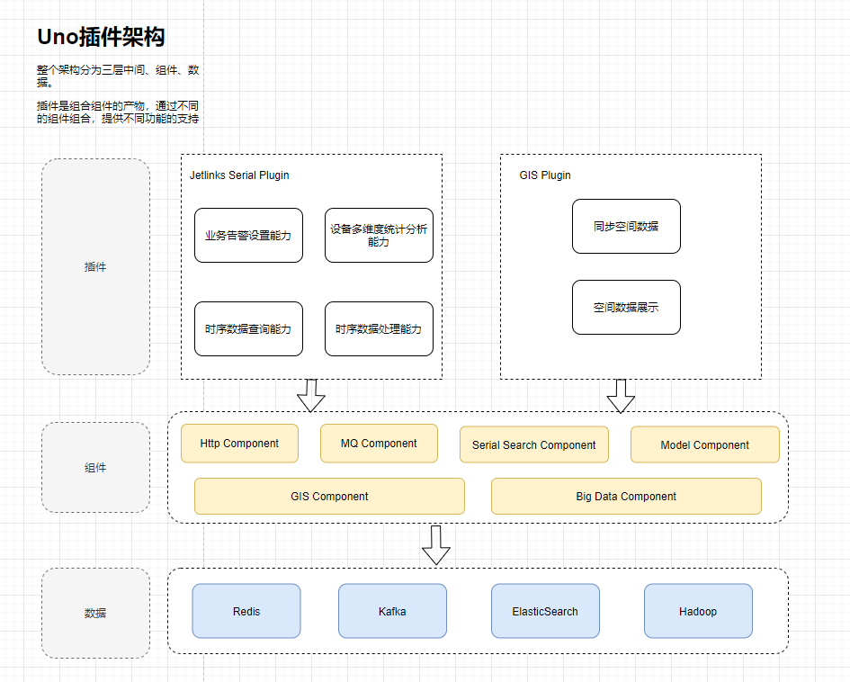

插件的架构分为三层，分别是插件、组件、数据。

- **数据**：提供基本数据操作支持。
- **组件**：提供基本的功能支持。
    - Http Component：拓展了HTTP调用，比如说：根据`OpenApi规范文档`生成具体的远程调用对象。
    - MQ Component：拓展MQ功能，提供简单的发布、订阅操作
    - Serial Search Component：对于时序数据库，提供的简单的api就可以查询到需要的时序数据
    - Model Component：对抽象模型进行定义，提供基本的模型或者文件模型
    - ...
- **插件**：组合不同的组件，对他们的提供的功能进行使用与拓展，最终形成可用的业务插件系统