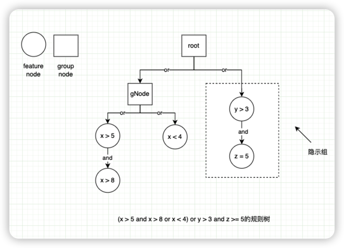
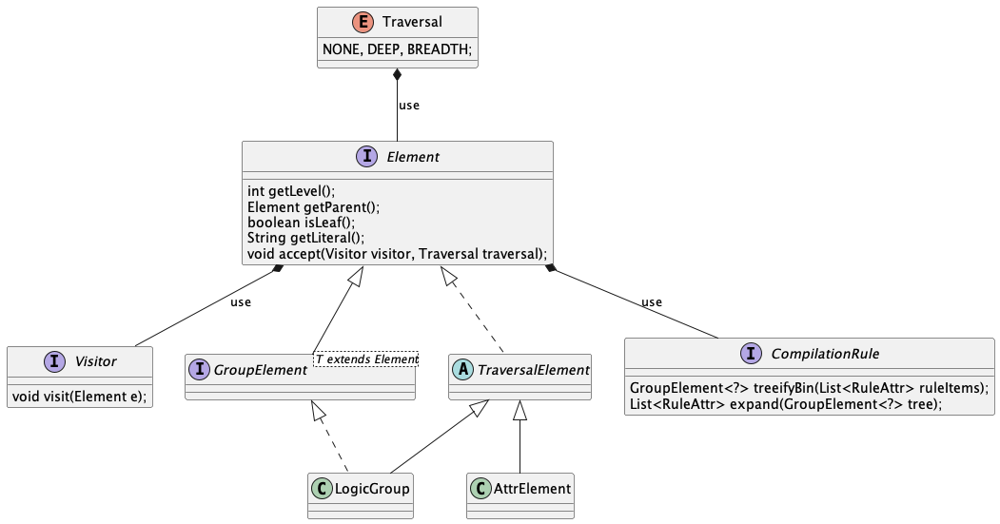
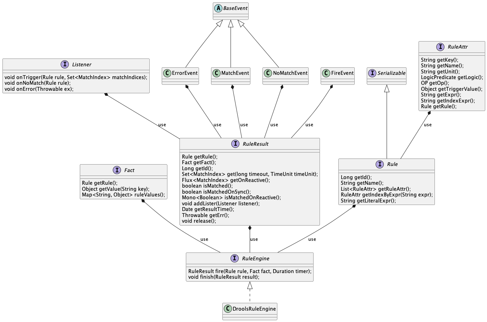

规则引擎核心是对条件表达式做出判断获取满足条件的指标与最后的结果集。通过分析条件表达式构建一颗'规则树'。


## 1.规则树

### 1.1 逻辑结构

> 规则树是以or and的逻辑关系进行组织，相同高度的树具有or的逻辑关系，子树具有and的关系。树的节点有两种类型，一种是group、一种是feature。
>
> - group是对节点进行组合，这种组合关系内部也是一颗规则树。
> - 另外一种是feature节点，feature节点以特征（指标）、比较关系（>、<、=）、比较值。
>
> 可以通过访问器模式对这棵规则树进行遍历，遍历的可以是深度优先，广度优先。



在上图是规则树的逻辑结构，通过逻辑谓词（OR、AND）来对不同的条件表达式进行描述。


### 1.2 物理结构

> 定义：每一个平展的规则项，其表达式以：&& a > 5、 || b < 5的形式解析，即每一个规则项以逻辑谓词作为其前缀，表达式为后缀。
>
> 对于一个规则树，其具有如下性质：
>
> - root节点一定是 AND GroupElement
>
> - 当遇到与当前不一致的逻辑谓词时，会创建新的逻辑谓词组。
>
> 算法逻辑如下（p指父节点，p.e只父节点非GroupElement的元素，n指当前节点，n.e只当前节点非GroupElement）：
>
> 1. 如果当前p是AND GroupElement，n是AND GroupElement：则把n.e放入p.e中
> 2. 如果当前p是AND GroupElement，n是OR GroupElement：则把n作为p的父级，p作n的子节点，n重新为父级
> 3. 如果当前p是OR GroupElement，n无论是OR 或者 AND GroupElement都创建新的Group：如果是AND GroupElement则把p.e 放入n.e中，如果是OR GroupElement则把p置为当前n



该树的遍历方式可以通过：

- Traversal.NONE：顺序访问

- Traversal.DEEP：深度优先遍历
- Traversal.BREADTH：广度优先遍历

### 1.3 示例

#DefaultCompilationRuleTest.java

```java
public class DefaultCompilationRuleTest extends BaseTestCase {

    // a && b || c ==> (a && b) || c
    ArrayList<RuleAttr> testA = Lists.newArrayList(
            RuleAttrBuilder.get().buildKey("a").buildOp(OP.EQUALITY).buildLogic(LogicPredicate.AND).buildTriggerValue("1").build(),
            RuleAttrBuilder.get().buildKey("b").buildOp(OP.EQUALITY).buildLogic(LogicPredicate.AND).buildTriggerValue("1").build(),
            RuleAttrBuilder.get().buildKey("c").buildOp(OP.EQUALITY).buildLogic(LogicPredicate.OR).buildTriggerValue("1").build()
    );

    // a || b && c ==> a || (b && c)
    ArrayList<RuleAttr> testB = Lists.newArrayList(
            RuleAttrBuilder.get().buildKey("a").buildOp(OP.EQUALITY).buildLogic(LogicPredicate.AND).buildTriggerValue("1").build(),
            RuleAttrBuilder.get().buildKey("b").buildOp(OP.EQUALITY).buildLogic(LogicPredicate.OR).buildTriggerValue("1").build(),
            RuleAttrBuilder.get().buildKey("c").buildOp(OP.EQUALITY).buildLogic(LogicPredicate.AND).buildTriggerValue("1").build()
    );

    // a && b || c || d ==> (a && b) || c || d
    ArrayList<RuleAttr> testC = Lists.newArrayList(
            RuleAttrBuilder.get().buildKey("a").buildOp(OP.EQUALITY).buildLogic(LogicPredicate.AND).buildTriggerValue("1").build(),
            RuleAttrBuilder.get().buildKey("b").buildOp(OP.EQUALITY).buildLogic(LogicPredicate.AND).buildTriggerValue("1").build(),
            RuleAttrBuilder.get().buildKey("c").buildOp(OP.EQUALITY).buildLogic(LogicPredicate.OR).buildTriggerValue("1").build(),
            RuleAttrBuilder.get().buildKey("d").buildOp(OP.EQUALITY).buildLogic(LogicPredicate.OR).buildTriggerValue("1").build()
    );

    // a && b || c && d ==> (a && b) || (c && d)
    ArrayList<RuleAttr> testD = Lists.newArrayList(
            RuleAttrBuilder.get().buildKey("a").buildOp(OP.EQUALITY).buildLogic(LogicPredicate.AND).buildTriggerValue("1").build(),
            RuleAttrBuilder.get().buildKey("b").buildOp(OP.EQUALITY).buildLogic(LogicPredicate.AND).buildTriggerValue("1").build(),
            RuleAttrBuilder.get().buildKey("c").buildOp(OP.EQUALITY).buildLogic(LogicPredicate.OR).buildTriggerValue("1").build(),
            RuleAttrBuilder.get().buildKey("d").buildOp(OP.EQUALITY).buildLogic(LogicPredicate.AND).buildTriggerValue("1").build()
    );

    @Test
    void testCompile() {
        CompilationRule compilationRule = CompilationRule.DEFAULT;

        GroupElement<?> groupElement = compilationRule.treeifyBin(testA);
        List<RuleAttr> expand = compilationRule.expand(groupElement);

        assertEquals(testA.size(), expand.size());

        GroupElement<?> b = compilationRule.treeifyBin(testB);
        GroupElement<?> c = compilationRule.treeifyBin(testC);
        GroupElement<?> d = compilationRule.treeifyBin(testD);
    }

    @Test
    void testTraversal() {
        CompilationRule compilationRule = CompilationRule.DEFAULT;

        GroupElement<?> groupElement = compilationRule.treeifyBin(testA);

        groupElement.accept(
                e -> {
                    System.out.println(e);
                });


        groupElement.accept(
                e -> {
                    System.out.println(e);
                },
                Traversal.BREADTH);


        groupElement.accept(
                e -> {
                    System.out.println(e);
                },
                Traversal.DEEP);
    }

    @Test
    void testOutboundLiteralVisitor() {
        CompilationRule compilationRule = CompilationRule.DEFAULT;

        GroupElement<?> ra = compilationRule.treeifyBin(testA);
        String la = ra.getLiteral();
        assertEquals("((\"a\" == \"1\" && \"b\" == \"1\" ) || \"c\" == \"1\" )", la);

        GroupElement<?> rb = compilationRule.treeifyBin(testB);
        String lb = rb.getLiteral();
        assertEquals("(\"a\" == \"1\"  || (\"b\" == \"1\" && \"c\" == \"1\" ) )", lb);
        GroupElement<?> rc = compilationRule.treeifyBin(testC);
        String lc = rc.getLiteral();
        assertEquals("((\"a\" == \"1\" && \"b\" == \"1\" ) || \"c\" == \"1\" || \"d\" == \"1\"  )", lc);
        GroupElement<?> rd = compilationRule.treeifyBin(testD);
        String ld = rd.getLiteral();
        assertEquals("((\"a\" == \"1\" && \"b\" == \"1\" ) || (\"c\" == \"1\" && \"d\" == \"1\" ) )", ld);
    }

}
```

## 2.规则引擎

在uno-rule中只构建了一套基础的规则引擎API，如下，包括：

- 规则实例`Rule`的定义
- 规则项`RuleAttr`的定义
- 事件与监听定义
- 执行结果定义
- 规则引擎定义

在封装成熟开源的规则引擎：

- drools
- easyrules
- ...

达到满足规则引擎做核心的需求。



在运行时，通过传递指定的规则实例（`Rule`）与事实对象（`Fact`）通过`RuleEngine`获取到`RuleResult`，获取最终的匹配结果。

> drools的 rateoo算法：https://docs.jboss.org/drools/release/5.2.0.Final/drools-expert-docs/html/ch03.html

### 2.1 示例

#DroolsRuleEngineTest.java

```java
public class DroolsRuleEngineTest extends BaseTestCase {

    DroolsRuleEngine droolsRuleEngine = RuleEngineFactory.get();

    @Test
    void testNoMatch() {
        Rule rule = RuleBuilder.get().buildRuleName("test")
                .addRuleAttr(RuleAttrBuilder.get().buildKey("a").buildOp(OP.EQUALITY).buildTriggerValue("1").build())
                .build();
        Fact fact = Fact.from(rule, "a", '1');
        fact.put("a", "0");
        RuleResult ruleResult = droolsRuleEngine.fire(rule, fact);

        ruleResult.addLister(new Listener() {
            @Override
            public void onTrigger(Rule rule, Set<MatchIndex> matchIndices) {

            }

            @Override
            public void onNoMatch(Rule rule) {
                System.out.println("1");
            }

            @Override
            public void onError(Throwable ex) {

            }
        });
        ruleResult.addLister(new Listener() {
            @Override
            public void onTrigger(Rule rule, Set<MatchIndex> matchIndices) {

            }

            @Override
            public void onNoMatch(Rule rule) {
                System.out.println("2");
            }

            @Override
            public void onError(Throwable ex) {

            }
        });
        Set<MatchIndex> matchs = ruleResult.get();
        assertEquals(0, matchs.size());
    }

    @Test
    void testOneRule() throws InterruptedException {
        Rule rule = RuleBuilder.get().buildRuleName("test")
                .addRuleAttr(RuleAttrBuilder.get().buildKey("a").buildOp(OP.EQUALITY).buildTriggerValue("1").build())
                .build();
        Fact fact = Fact.from(rule, "a", '1');
        fact.put("a", "1");
        RuleResult ruleResult = droolsRuleEngine.fire(rule, fact);

        Set<MatchIndex> matchIndices = ruleResult.get();

        assertEquals(1, matchIndices.size());
    }

    @Test
    void testTwoRuleAttr() {
        Rule rule = RuleBuilder.get().buildRuleName("test")
                .addRuleAttr(RuleAttrBuilder.get().buildKey("a").buildOp(OP.EQUALITY).buildTriggerValue("1").build())
                .addRuleAttr(RuleAttrBuilder.get().buildKey("b").buildOp(OP.EQUALITY).buildLogic(LogicPredicate.AND).buildTriggerValue("1").build())
                .build();

        Fact fact1 = Fact.from(rule, "a", '1');
        RuleResult ruleResult = droolsRuleEngine.fire(rule, fact1);
        Set<MatchIndex> matchIndices = ruleResult.get();
        assertEquals(0, matchIndices.size());


        Fact fact2 = Fact.from(rule, "a", '1', "b", "1");
        Set<MatchIndex> matchs = droolsRuleEngine.fire(rule, fact2).get();
        assertEquals(2, matchs.size());
    }

    @Test
    void testMultiRule() {
        Rule rule1 = RuleBuilder.get().buildRuleName("test")
                .addRuleAttr(RuleAttrBuilder.get().buildKey("a").buildOp(OP.EQUALITY).buildTriggerValue("1").build())
                .build();
        Fact fact1 = Fact.from(rule1, "a", '1');
        Set<MatchIndex> matchs = droolsRuleEngine.fire(rule1, fact1).get();
        assertEquals(1, matchs.size());

        Rule rule2 = RuleBuilder.get().buildRuleName("test2")
                .addRuleAttr(RuleAttrBuilder.get().buildKey("a").buildOp(OP.EQUALITY).buildTriggerValue("1").build())
                .addRuleAttr(RuleAttrBuilder.get().buildKey("b").buildOp(OP.EQUALITY).buildLogic(LogicPredicate.AND).buildTriggerValue("1").build())
                .build();
        Fact fact2 = Fact.from(rule2, "a", "1", "b", "1");
        Set<MatchIndex> matchs1 = droolsRuleEngine.fire(rule2, fact2).get();
        assertEquals(2, matchs1.size());

        Fact fact3 = Fact.from(rule2, "a", "1");
        RuleResult result = droolsRuleEngine.fire(rule2, fact3);
        Set<MatchIndex> matchs3 = result.get();
        assertFalse(result.isMatched());

    }

    @Test
    void testComplexCondition() {
        Rule rule = RuleBuilder.get().buildRuleName("test")
                // a > 1 && b == 1 || c < 5
                .addRuleAttr(RuleAttrBuilder.get().buildKey("a").buildOp(OP.GREATER_THAN).buildTriggerValue("1").build())
                .addRuleAttr(RuleAttrBuilder.get().buildKey("b").buildOp(OP.EQUALITY).buildTriggerValue("1").build())
                .addRuleAttr(RuleAttrBuilder.get().buildKey("c").buildOp(OP.LESS_THAN).buildLogic(LogicPredicate.OR).buildTriggerValue("5").build())
                .build();
        // match
        Fact factMatch = Fact.from(rule, "a", "2", "b", "1", "c", "3");
        RuleResult result = droolsRuleEngine.fire(rule, factMatch);
        Set<MatchIndex> matchs = result.get();
        assertEquals(3, matchs.size());
    }

    @Test
    void testReactiveError() {
        Rule rule = RuleBuilder.get().buildRuleName("test")
                // a > 1
                .addRuleAttr(RuleAttrBuilder.get().buildKey("a").buildOp(OP.GREATER_THAN).buildTriggerValue(new Date()).build())
                .build();

        Fact factMatch = Fact.from(rule, "a", "2");
        RuleResult result = droolsRuleEngine.fire(rule, factMatch);
        result.isMatchedOnReactive()
                .as(StepVerifier::create)
                .expectNext(false)
                .verifyComplete();
    }

    @Test
    void testCompareDate() {
        Date cv = DateUtil.parse("2023-05-19 17:00:00");
        Date fv = DateUtil.parse("2023-05-19 18:00:00");
        Rule rule = RuleBuilder.get().buildRuleName("test")
                // a <= 2023-05-19 18:00:00
                .addRuleAttr(RuleAttrBuilder.get().buildKey("a").buildOp(OP.LESS_THAN_EQUAL).buildTriggerValue(fv).build())
                .build();
        Fact factMatch = Fact.from(rule, "a", cv);
        RuleResult result = droolsRuleEngine.fire(rule, factMatch);
        Set<MatchIndex> matchIndices = result.get();
        assertEquals(1, matchIndices.size());
    }

    @Test
    void testCompareRangeDate() {
        Date sv = DateUtil.parse("2023-05-19 17:00:00");
        Date ev = DateUtil.parse("2023-05-19 18:00:00");
        Date cv = DateUtil.parse("2023-05-19 17:30:00");
        Date tv = DateUtil.parse("2023-05-19 19:30:00");
        Rule rule = RuleBuilder.get().buildRuleName("test")
                // a <= 2023-05-19 18:00:00
                .addRuleAttr(RuleAttrBuilder.get().buildKey("a").buildOp(OP.LESS_THAN_EQUAL).buildTriggerValue(ev).build())
                // a >= 2023-05-19 17:00:00
                .addRuleAttr(RuleAttrBuilder.get().buildKey("a").buildOp(OP.GREATER_THAN_EQUAL).buildTriggerValue(sv).build())
                .build();
        Fact f1 = Fact.from(rule, "a", cv);
        RuleResult r1 = droolsRuleEngine.fire(rule, f1);
        Set<MatchIndex> m1 = r1.get();
        assertEquals(2, m1.size());
        Fact f2 = Fact.from(rule, "a", tv);
        RuleResult r2 = droolsRuleEngine.fire(rule, f2);
        Set<MatchIndex> m2 = r2.get();
        assertEquals(0, m2.size());
    }

    @Test
    void testPerformance() {
        // 10000
        Rule rule = RuleBuilder.get().buildRuleName("test")
                .addRuleAttr(RuleAttrBuilder.get().buildKey("a").buildOp(OP.EQUALITY).buildTriggerValue("1").build())
                .build();
        Fact fact = Fact.from(rule, "a", "1");
        for (int i = 0; i < 100000; i++) {
            RuleResult ruleResult = droolsRuleEngine.fire(rule, fact);
//            ruleResult.addLister(new Listener() {
//                @Override
//                public void onTrigger(Rule rule, Set<MatchIndex> matchIndices) {
//                    assertEquals(1, matchIndices.size());
//                }
//
//                @Override
//                public void onNoMatch(Rule rule) {
//
//                }
//
//                @Override
//                public void onError(Throwable ex) {
//
//                }
//            });
            Set<MatchIndex> matchIndices = ruleResult.get();
            assertEquals(1, matchIndices.size());
        }
    }

    /**
     * Test Case: 多规则触发
     */
    @Test
    void testMultiTrigger() {
        Rule ruleA = RuleBuilder.get().buildRuleName("ruleA")
                .addRuleAttr(RuleAttrBuilder.get().buildKey("a").buildOp(OP.EQUALITY).buildTriggerValue("1").build())
                .build();

        Fact factA = Fact.from(ruleA, "b", "1");
        RuleResult fireA = droolsRuleEngine.fire(ruleA, factA);

        Rule ruleB = RuleBuilder.get().buildRuleName("ruleB")
                .addRuleAttr(RuleAttrBuilder.get().buildKey("b").buildOp(OP.EQUALITY).buildTriggerValue("1").build())
                .build();
        Fact factB = Fact.from(ruleA, "b", "1");
//        RuleResult fireB = droolsRuleEngine.fire(ruleB, factB);

        Rule ruleC = RuleBuilder.get().buildRuleName("ruleC")
                .addRuleAttr(RuleAttrBuilder.get().buildKey("b").buildOp(OP.EQUALITY).buildTriggerValue("1").build())
                .addRuleAttr(RuleAttrBuilder.get().buildKey("a").buildOp(OP.GREATER_THAN).buildTriggerValue("1").buildLogic(LogicPredicate.OR).build())
                .build();
        Fact factC = Fact.from(ruleA, "b", "1", "a", "2");
        RuleResult fireC = droolsRuleEngine.fire(ruleC, factC);

//        RuleResult fireD = droolsRuleEngine.fire(ruleB, factB);

        Flux.merge(fireA.getOnReactive(),  fireC.getOnReactive())
                .subscribe();
//        Set<MatchIndex> matchIndices = fireD.get();
//        System.out.println(matchIndices);
//        Set<MatchIndex> matchIndices1 = fireC.get();

    }
}
```

