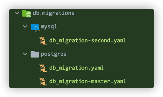

# Liquibase数据库版本控制

版本号：1.1.5.RELEASE

<a href="https://liquibase.org/">liquibase</a>是一个数据库变更的版本控制工具。项目中通过liquibase解析用户编写的liquibase的配置文件,生成sql语句，并执行和记录。执行是根据记录确定sql语句是否曾经执行过，和配置文件里的预判断语句确定sql是否执行。

特性：

1、配置文件支持SQL、XML、JSON 或者 YAML
 2、版本控制按序执行
 3、可以用上下文控制sql在何时何地如何执行。
 4、支持schmea的变更
 5、根据配置文件自动生成sql语句用于预览
 6、可重复执行迁移
 7、可插件拓展
 8、可回滚
 9、可兼容14中主流数据库如oracle，mysql，pg等，支持平滑迁移
 10、支持schema方式的多租户(multi-tenant)

## 为什么使用Liquibase

在大多数项目仍然提供`sql`脚本甚至有时不这样（哪里漏水堵哪里）：

- What state is the database in onTrigger this machine?（不知道在这台机器数据库的状态）
- Has this script already been applied or not?（这个脚本是否被使用过）
- Has the quick fix in production been applied in test afterwards?（生产用了，测试是否用了？）
- How do you set up a new database instance?（怎么从头开始创建一个新的数据库）

所以数据库版本管理框架是用来解决这种混乱的局面：他们允许你：

- Recreate a database from scratch（重新开始创建一个数据库）
- Make it clear at all times what state a database is in（在任何时刻知道数据库状态）
- Migrate in a deterministic way from your current version of the database to a newer one（以一种确定的方式从你当前的数据库版本迁移到一个较新的版本）

### 为什么不使用flyway

[Flyway](https://flywaydb.org/) 是一款开源的数据库版本管理工具，使用方式和学习成本与Liquibase差不多，但它无法很好适用于微服务形式，原因在于它的版本控制多团队开发可能存在冲突。但Liquibase可以自定义版本，这点就很适合用于多团队多服务数据库版本管理

## 使用

blade的Liqubase目前仅支持change-log文件读取，暂不支持指定rollback等更多配置内容。

Liquibase的核心原理是通过读取`change-log`文件。所以在使用时，我们首先创建这个文件，这个文件应该创建在哪里？

默认需要创建在类路径下：**/db/migrations/#{dbType}/db_migration.yaml**。

### 文件路径

#### 单数据源

我们可以看到这个目录中存在一个占位符，这个占位符的类型表示当前服务使用的数据源类型，比如当前数据源是**mysql**，文件存放路径如：/db/migrations/mysql/db_migration.yaml（后缀也可以是`.xml/.json/.sql`,怎么配置详细看官网文档）。同理如果切换其他数据源我们就需要创建相应的目录文件。

有时候我们又想指定目录就能读取到，基于这个需要，单数据源只需要在spring 配置中增加`spring.liquibase.change-log`并且填写对应的目录

```yaml
spring:
  liquibase:
    change-log: classpath:test.yaml
```

#### 多数据源

会存在一个情况我们使用的服务存在多数据源，这个时候可以对不同的数据源执行不同的版本控制，但前提我们的文件名称需要变一下。比如说：想使用master数据源进行版本控制，那么此时你的文件名称就变为`db_migration-master.yaml`，同理其他数据源也是一样的配置。就如下面这张图一样



指定目录在多数据源配置如下：

```yaml
spring:
  #排除DruidDataSourceAutoConfigure
  autoconfigure:
    exclude: com.alibaba.druid.spring.boot.autoconfigure.DruidDataSourceAutoConfigure
  datasource:
    dynamic:
      druid:
        #通用校验配置
        validation-query: select 1
        #启用sql日志拦截器
        proxy-filters:
          - sqlLogInterceptor
      #设置默认的数据源或者数据源组,默认值即为master
      primary: master
      datasource:
        master:
          druid:
            #独立校验配置
            validation-query: select 1
            #oracle校验
            #validation-query: select 1 from dual
          url: ${blade.datasource.dev.master.url}
          username: ${blade.datasource.dev.master.username}
          password: ${blade.datasource.dev.master.password}
          liquibase:
            change-log: classpath:test.yaml
```

### 文件内容

在知道change-log文件路径在哪后，我们来具体看看它里面存在什么内容：

```yaml
databaseChangeLog:
  # 一次数据库版本变化都是一个变更集
  - changeSet:
      # 命名规则：框架（系统名）-服务-版本号-功能（或者目的）
      id: jw-test-V1-Person
      author: jiangwei
      comment: 创建Person表
      runInTransaction: true
      changes:
        # 创建表结构
        - sqlFile:
            path: classpath:db/migrations/mysql/sql/V1__Person.sql
            encoding: utf8
        # 创建表数据
        - sqlFile:
            path: classpath:db/migrations/mysql/sql/V1__Person_Data.sql
            encoding: utf8
  - changeSet:
      id: jw-test-V1-Person-task
      author: jiangwei
      changes:
        # 创建自定义数据变更类
        - customChange: { "class": "com.jw.liquibase.change.PersonChangeTask" }

```

Liquibase每次数据库变更都是以`change-set`作为一个变更集，所以我们每次一个功能版本都是一个`change-log`。在一个`change-log`中需要指定`id`、`author`。其中：

- id：命名规则：框架（系统名）-服务-版本号-功能（或者目的），比如：blade-auth-V1-init（blade系统-认证服务-第一个版本-初始化）

在`change-set`中`changes`是为最重要，他表示当前变更的内容。它有两种好使用的方式：

- sqlFile：指定一个sql文件路径

- customChange：指定一个实现`CustomTaskChange`接口的权限类名，如下：

  ```java
  public class PersonChangeTask implements CustomTaskChange {
  
      @Override
      public void execute(Database database) throws CustomChangeException {
          Person person = new Person(4, "Jiang Wei");
          PersonMapper mapper = SpringUtil.getContext().getBean(PersonMapper.class);
          mapper.insert(person);
      }
  
      @Override
      public String getConfirmationMessage() {
          return null;
      }
  
      @Override
      public void setUp() throws SetupException {
  
      }
  
      @Override
      public void setFileOpener(ResourceAccessor resourceAccessor) {
  
      }
  
      @Override
      public ValidationErrors validate(Database database) {
          return null;
      }
  }
  
  ```

需要注意的点：如果使用自定义变更类（`CustomTaskChange`）他不能读取和他在一个变更集执行的库表数据内容（比如我当前sqlFile是创建`Person`表，但是如果在`CustomTaskChange`中将读取不到这张表的内容，因为他们处于同一个事物中）解决办法是放在不同的变更集中。如上面所示。

## uno-starter-liquibase原理

在具体实现最重要的是两点：

1. 读取到change-log的内容
2. 不同的数据源具有不同的change-log内容

解决办法是，制定如下规则：

1.自动读取配置文件（也可以人工配置，如果有）：分数据库类型

​	单数据源：以db_migration.yaml或者db_migration.xml作为查找条件

​    多数据源：以db_migration-#{dynamic}.yaml或者db_migration-#{dynamic}.xml作为查找条件

2.指定配置读取

​	单数据源：读取spring.liquibase.changelog

​	多数据源：读取spring.datasource.dynamic.datasource.\#{dynamic}.liquibase.changelog配置

因为考虑到数据源类型的多种多样，所以采取适配器设计模式，它的顶层接口是`LiquibaseDataSourceAdapter`。

我们在获取到`change-log`路径后需要创建`SpringLiquibase`注册到Spring中，让他自动执行变更集，具体代码如下：

```java
	/**
	 * 向Spring注册Liquibase对象
	 *
	 * @param dataSource  数据源对象
	 * @param beanFactory bean工厂
	 */
	default void registerLiquibase(DataSource dataSource, DefaultListableBeanFactory beanFactory) {
		String changeLog = getChangeLog(dataSource);
		if (StringUtils.isEmpty(changeLog)) {
			return;
		}
		SpringLiquibase liquibase = new SpringLiquibase();
		liquibase.setChangeLog(changeLog);
		liquibase.setDataSource(dataSource);
		BeanDefinitionBuilder beanDefinitionBuilder = BeanDefinitionBuilder.genericBeanDefinition(SpringLiquibase.class, () -> liquibase);
		beanFactory.registerBeanDefinition("liquibase-".concat(dbType(dataSource)), beanDefinitionBuilder.getRawBeanDefinition());
	}
```

## change-log

changelog是LiquiBase用来记录数据库的变更，一般放在`CLASSPATH`下，然后配置到执行路径中。

changelog支持多种格式，主要有`XML/JSON/YAML/SQL，其中XML/JSON/YAML除了具体格式语法不同，节点配置很类似，SQL格式中主要记录SQL语句，这里仅给出XML格式和SQL格式的示例：

`change-log.xml`:

```xml
<changeSet id="2" author="daniel" runOnChange="true">
    <insert tableName="contest_info">
        <column name="id">3</column>
        <column name="title">title 3</column>
        <column name="content">content 3</column>
    </insert>
</changeSet>
```

`change-log.sql`

```sql
--liquibase formatted sql
--changeset daniel:16040707
CREATE TABLE `role_authority_sum` (
  `row_id` int(11) unsigned NOT NULL AUTO_INCREMENT COMMENT '自增id',
  `role_id` int(11) unsigned NOT NULL DEFAULT '0' COMMENT '关联role的role_id',
  `authority_sum` int(11) unsigned NOT NULL DEFAULT '0' COMMENT 'perms的值的和',
  `data_type_id` int(11) unsigned NOT NULL DEFAULT '0' COMMENT '关联data_type的id',
  PRIMARY KEY (`row_id`)
) ENGINE=InnoDB DEFAULT CHARSET=utf8 COMMENT='角色的权限值的和，如角色有RD权限，则和为2+8=10';
```

### change-set

一个`<changeSet>`标签对应一个变更集，由id、name、以及changelog的文件路径组成唯一标识。changelog在执行的时候并不是按照id的顺序，而是按照changeSet在changelog中出现的顺序。

LiquiBase在执行changelog时，会在数据库中插入两张表：`DATABASECHANGELOG`和`DATABASECHANGELOGLOCK`，分别记录changelog的执行日志和锁日志。

LiquiBase在执行changelog中的changeSet时，会首先查看`DATABASECHANGELOG`表，如果已经执行过，则会跳过（除非changeSet的`runAlways`属性为true，后面会介绍），如果没有执行过，则执行并记录changelog日志；

changelog中的一个changeSet对应一个事务，在changeSet执行完后commit，如果出现错误则rollback；

- runAlways：即使已经执行过，仍然每次都执行；**注意**: 由于`DATABASECHANGELOG`表中还记录了changeSet的MD5校验值MD5SUM，如果changeSet的`id`和`name`没变，而内容变了，则由于MD5值变了，即使runAlways的值为True，执行也是失败的，会报错。这种情况应该使用`runOnChange`属性。
- runOnChange：第一次的时候执行以及当changeSet的内容发生变化时执行。不受MD5校验值的约束。
- runInTransaction：是否作为一个事务执行，默认为true。设置为false时需要**小心**：如果执行过程中出错了则不会rollback，数据库很可能处于不一致的状态；

`<changeSet>`下有一个重要的子标签`<rollback>`，即定义回滚的SQL语句。对于`create table`, `rename column`和`add column`等，LiquiBase会自动生成对应的rollback语句，而对于`drop table`、`insert data`等则需要显示定义rollback语句。

### include与include-all

当changelog文件越来越多时，可以使用`<include>`将文件管理起来，如：

```xml
<?xml version="1.0" encoding="utf-8"?>
<databaseChangeLog
    xmlns:xsi="http://www.w3.org/2001/XMLSchema-instance"
    xmlns="http://www.liquibase.org/xml/ns/dbchangelog"
    xsi:schemaLocation="http://www.liquibase.org/xml/ns/dbchangelog
    http://www.liquibase.org/xml/ns/dbchangelog/dbchangelog-3.1.xsd">
    <include file="logset-20160408/0001_authorization_init.sql" relativeToChangelogFile="true"/>
</databaseChangeLog>
```
## Spring-Liquibase配置文件

| 属性名                                     | 说明                                                         | 默认值                                                |
| ------------------------------------------ | ------------------------------------------------------------ | ----------------------------------------------------- |
| spring.liquibase.change-log                | 变更日志配置路径                                             | classpath:/db/changelog/db.changelog-master.<br/>yaml |
| spring.liquibase.check-change-log-location | 检查变更日志位置是否存在                                     | true                                                  |
| spring.liquibase.liquibase.contexts        | 要使用的运行时上下文的逗号分隔列表。                         |                                                       |
| spring.liquibase.default-schema            | 默认的数据库Schema                                           |                                                       |
| spring.liquibase.drop-first                | 先删除数据库Schema                                           |                                                       |
| spring.liquibase.enabled                   | 是否开启liquibase                                            |                                                       |
| spring.liquibase.password                  | 待迁移数据库的登录密码。                                     |                                                       |
| spring.liquibase.url                       | 待迁移数据库的JDBC URL。如果没有设置，就使用配置的主数据源。 |                                                       |
| spring.liquibase.user                      | 待迁移数据库的登录用户。                                     |                                                       |

