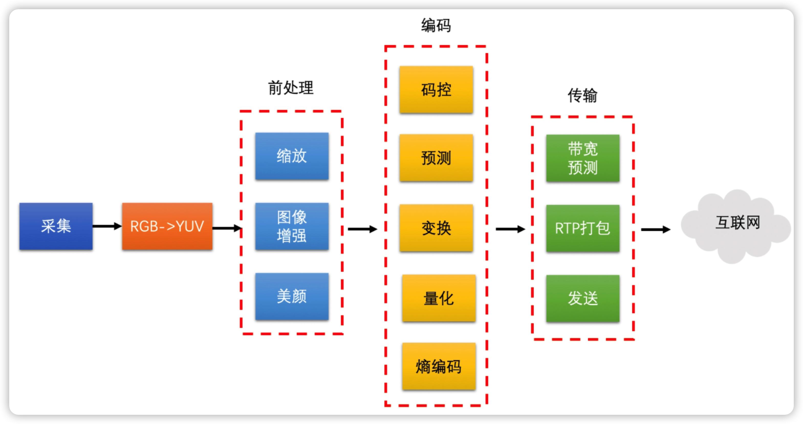
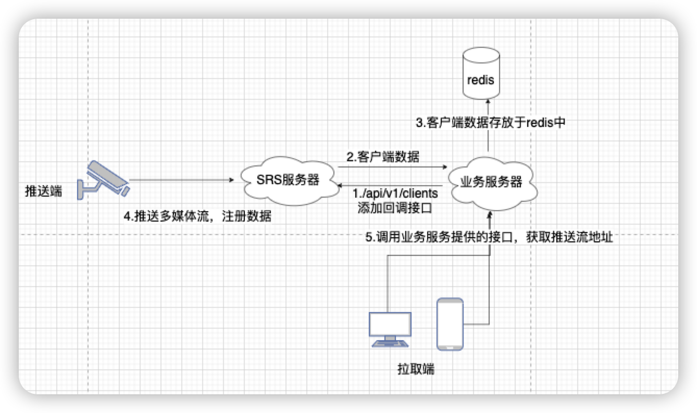
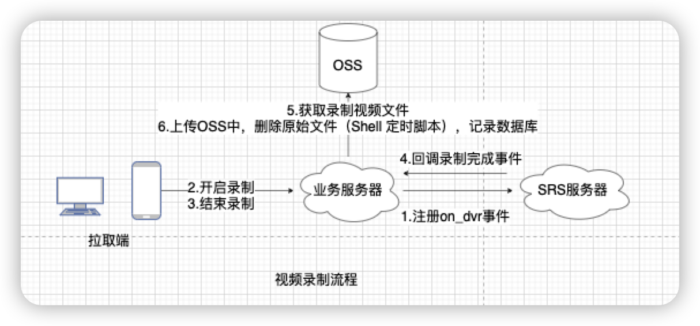
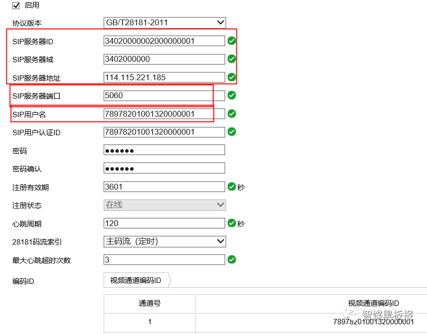
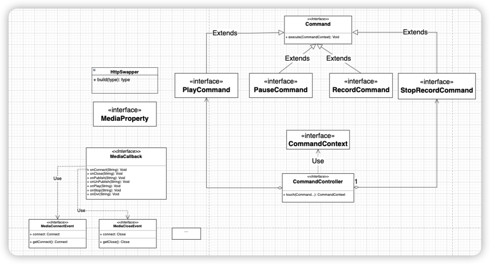

# 1.技术方案

## 1.1 音视频技术

音视频码流从采集->前处理->编码->传输，这是他的发送端.



再看看接收端，数据缓冲区->音画同步->解码->渲染.


音视频技术涉及面广而杂，并且又有不同的协议保证数据传输，比如

- SIP（Session initialization Protocol，会话初始协议）：是由IETF（Internet Engineering Task Force，因特网工程任务组）制定的多媒体通信协议。它是一个基于文本的应用层控制协议，用于创建、修改和释放一个或多个参与者的会话。SIP 是一种源于互联网的IP 语音会话控制协议，具有灵活、易于实现、便于扩展等特点。
- RTP（Real-time Transport Protocol，实时传输协议）：RTP协议详细说明了在[互联网](https://baike.baidu.com/item/互联网)上传递音频和视频的标准数据包格式。RTP协议常用于[流媒体](https://baike.baidu.com/item/流媒体)系统（配合RTSP协议），视频会议和[一键通](https://baike.baidu.com/item/一键通)（Push to Talk）系统（配合H.323或SIP），使它成为[IP电话](https://baike.baidu.com/item/IP电话)产业的技术基础。RTP协议和RTP控制协议[RTCP](https://baike.baidu.com/item/RTCP)一起使用，而且它是创建在[UDP协议](https://baike.baidu.com/item/UDP协议)上的。

- RTMP（Real Time Messaging Protocol，实时消息传输协议）：Adobe Systems公司为Flash播放器和服务器之间音频、视频和数据传输 开发的开放协议。
- RTSP（Real Time Streaming Protocol，实时流传输协议）：该协议定义了一对多应用程序如何有效地通过[IP网络](https://baike.baidu.com/item/IP网络)传送多媒体数据。RTSP在[体系结构](https://baike.baidu.com/item/体系结构/8174145)上位于RTP和RTCP之上，它使用TCP或UDP完成数据传输。
- HLS（HTTP Live Streaming，基于HTTP的自适应码率流媒体传输协议）：HLS (HTTP Live Streaming)是Apple的动态码率[自适应技术](https://baike.baidu.com/item/自适应技术/2209007)。主要用于PC和Apple终端的音视频服务。包括一个m3u(8)的索引文件，TS媒体分片文件和key加密串文件。
- HTTP-FLV：HTTP FLV将RTMP封装在HTTP协议之上的，可以更好的穿透防火墙等。
- WebRTC（Web Real-Time Communication 网页即时通信）：是一个支持[网页浏览器](https://baike.baidu.com/item/网页浏览器)进行实时语音对话或视频对话的[API](https://baike.baidu.com/item/API)
- GB/T28181（安全防范视频监控联网系统信息传输、交换、控制技术要求，可以简单理解为SIP协议+RTP协议）: 该标准规定了城市监控报警联网系统中[信息传输](https://baike.baidu.com/item/信息传输/9897864)、交换、控制的互联结构、通信协议结构，传输、交换、控制的基本要求和安全性要求，以及控制、传输流程和协议接口等技术要求。该标准适用于安全防范监控报警联网系统的方案设计、系统检测、验收以及与之相关的设备研发、生产，其他信息系统可参考采用。


作为业务系统如果需要考虑数据的传输、编解码、视频花屏卡顿等问题，甚至不同网络协议之间转码交换等问题，那必然需要研发一个流媒体服务来统一解决上述的问题，甚好市面上已经有成熟的流媒体技术，那就是**SRS**。

## 1.2 SRS（Simple Realtime Server）

SRS定位是运营级的互联网直播服务器集群，追求更好的概念完整性和最简单实现的代码。SRS提供了丰富的接入方案将RTMP流接入SRS， 包括推送RTMP到SRS、推送RTSP/UDP/FLV到SRS、拉取流到SRS。 SRS还支持将接入的RTMP流进行各种变换，譬如将RTMP流转码、流截图、 转发给其他服务器、转封装成HTTP-FLV流、转封装成HLS、 转封装成HDS、支持SRT流、录制成FLV/MP4。SRS包含支持大规模集群如CDN业务的关键特性， 譬如RTMP多级集群、源站集群、VHOST虚拟服务器 、 无中断服务Reload、HTTP-FLV集群。此外，SRS还提供丰富的应用接口， 包括HTTP回调、安全策略Security、HTTP API接口、 RTMP测速。SRS在源站和CDN集群中都得到了广泛的应用Applications。

在我看来，推荐SRS作为流媒体人学习和使用的N个理由：

1. SRS最大的特点就是简单，表现在代码架构简单，实现简单，部署简单，运维简单；
2. 源代码彻底开源，采用了IMT非常宽松的开源协议，同时Git上有非常丰富的Wiki文档资料和提交了大量Issuse，非常适合学习和商用；
3. SRS有丰富的周边开发工具，有自研播放器和性能压测工具，分分钟搭建一套直播系统，直接可以上手相应环境验证功能和代码调试；
4. SRS已经迭代到4.0版本，功能很丰富，支持多源输入也支持多协议分发，你能看到的RTMP、HLS、DASH、RTSP、GB28181、WebRTC、SRT、HTTP-FLV都支持接入和分发；
5. SRS即支持小规模集群也支持大规模集群，特别是对CDN业务的关键特性的支持，性能稳定性都线上跑过和压测过，质量有一定的保障，定位成运营级的互联网直播服务器此言非虚；


# 2.设计

视频监控安防领域，监控设备需要遵守《**GB/T-28181》**提出的技术要求，其中包括传输要求、交换要求、控制要求、安全性要求以及控制、传输流程协议接口等。虽然《GB/T-28181》是国家标准但各个厂商实现的不标准，对于很多细小的问题需要接受方来兼容，所以SRS实现《**GB/T-28181**》媒体接入、与播放、暂停部分，并提供Restful接口，对于控制需要自己实现**信令**。

下文将探讨怎么解决的四个重要问题：

- 实时视频流推拉端实现
- 录播
- 指令下发
- 设备管理

## 2.1 SRS安装

### 2.1.1 源文件编译安装

拉取gb28181代码

```shell
git clone https://github.com/ossrs/srs-gb28181.git
```

编译

```shell
cd srs/trunk
./configure
make
```

指定gb28181配置文件启动服务器

```shell
./objs/srs -c conf/push.gb28181.conf
```

```properties
# push gb28181 stream to SRS.

listen                  8085;
max_connections         1000;
daemon              off;
srs_log_tank        console;

http_api {
    enabled         on;
    listen          8086;
}

http_server {
    enabled         on;
    listen          8083;
}

stats {
    network         0;
}

stream_caster {
    enabled             on;
    caster              gb28181;

    # 转发流到rtmp服务器地址与端口
    # TODO: https://github.com/ossrs/srs/pull/1679/files#r400875104
    # [stream] is VideoChannelCodecID(视频通道编码ID) for sip
    # 自动创建的道通[stream] 是‘chid[ssrc]’ [ssrc]是rtp的ssrc
    # [ssrc] rtp中的ssrc
    output              rtmp://122.112.232.162:8085/live/[stream];
    
    # 接收设备端rtp流的多路复用端口
    listen              9000;
    # 多路复用端口类型，on为tcp，off为udp
    # 默认：on
    tcp_enable            on;

    # rtp接收监听端口范围，最小值
    rtp_port_min        58200;
    # rtp接收监听端口范围，最大值
    rtp_port_max        58300;

    # 是否等待关键帧之后，再转发，
    # off:不需等待，直接转发
    # on:等第一个关键帧后，再转发
    wait_keyframe       on;
    
    # rtp包空闲等待时间，如果指定时间没有收到任何包
    # rtp监听连接自动停止，发送BYE命令
    rtp_idle_timeout    30;

    # 是否转发音频流
    # 目前只支持aac格式，所以需要设备支持aac格式
    # on:转发音频
    # off:不转发音频，只有视频
    # *注意*!!!:flv 只支持11025  22050  44100 三种
    # 如果设备端没有三种中任何一个，转发时为自动选择一种格式
    # 同时也会将adts的头封装在flv aac raw数据中
    # 这样的话播放器为自动通过adts头自动选择采样频率
    # 像ffplay, vlc都可以，但是flash是没有声音，
    # 因为flash,只支持11025 22050 44100
    audio_enable        off;


    # 服务器主机号，可以域名或ip地址
    # 也就是设备端将媒体发送的地址，如果是服务器是内外网
    # 需要写外网地址，
    # 调用api创建stream session时返回ip地址也是host
    # $CANDIDATE 是系统环境变量，从环境变量获取地址，如果没有配置，用*
    # *代表指定stats network 的网卡号地址，如果没有配置network，默认则是第0号网卡地址
    # TODO: https://github.com/ossrs/srs/pull/1679/files#r400917594
    host       122.112.232.162;

    #根据收到ps rtp包自带创建rtmp媒体通道，不需要api接口创建
    #rtmp地址参数[stream] 就是通道id  格式chid[ssrc]
    auto_create_channel   off;

    sip {
        # 是否启用srs内部sip信令
        # 为on信令走srs, off 只转发ps流
        enabled on;
        
        # sip监听udp端口
        listen              5060;
        
        # SIP server ID(SIP服务器ID).
        # 设备端配置编号需要与该值一致，否则无法注册
        serial              34020000002000000001;

        # SIP server domain(SIP服务器域)
        realm               3402000000;

        # 服务端发送ack后，接收回应的超时时间，单位为秒
        # 如果指定时间没有回应，认为失败
        ack_timeout         30;

        # 设备心跳维持时间，如果指定时间内(秒）没有接收一个心跳
        # 认为设备离线
        keepalive_timeout   120;

        # 注册之后是否自动给设备端发送invite
        # on: 是  off 不是，需要通过api控制
        auto_play           on;
        # 设备将流发送的端口，是否固定
        # on 发送流到多路复用端口 如9000
        # off 自动从rtp_mix_port - rtp_max_port 之间的值中
        # 选一个可以用的端口
        invite_port_fixed     on;

        # 向设备或下级域查询设备列表的间隔，单位(秒)
        # 默认60秒
        query_catalog_interval  60;
    }
}

rtc_server {
    enabled         on;
    # Listen at udp://8000
    listen          8000;
    #
    # The $CANDIDATE means fetch from env, if not configed, use * as default.
    #
    # The * means retrieving server IP automatically, from all network interfaces,
    # @see https://github.com/ossrs/srs/issues/307#issuecomment-599028124
    candidate       $CANDIDATE;
}

vhost __defaultVhost__ {
    rtc {
        enabled     on;
        bframe      discard;
    }

    http_remux {
        enabled     on;
        mount       [vhost]/[app]/[stream].flv;
    }
}
```


### 2.1.2 Docker安装

```shell
CANDIDATE="192.168.1.10"
docker run --rm -it -p 1935:1935 -p 1985:1985 -p 8080:8080 -p 1990:1990 -p 8088:8088 \
    --env CANDIDATE=$CANDIDATE -p 8000:8000/udp \
    registry.cn-hangzhou.aliyuncs.com/ossrs/srs:4 ./objs/srs -c conf/push.gb28181.conf
```

### 2.1.3 k8s安装

## 2.2 实时视频流推拉


上图中，流媒体服务相当于一个中转站，把推送端推送的流数据经过推送协议（可能是GB28181、RTP、RTMP协议）到流媒体服务器中，拉流端指定拉流协议（HTTP-FLV、HLS等协议）从流媒体服务器中拉取多媒体数据流（不同协议之间的兼容）。

### 2.2.1 推拉

在**SRS流服务器**也提供了这样的一个能力，并提供了对应的Restful Api更全面的获取多媒体数据流地址、以及对应的客户端的数据，在SRS无论是推流还是拉流都被看作客户端，如下面列子，获取所以的客户端，其中`type=fmle-publish`表示这是一个推流端

```json
# /api/v1/clients // 获取所有的客户端数据
{
"code": 0,
"server": "vid-76fg31s",
"clients": [
  {
    "id": "85489ped",
    "vhost": "vid-831v804",
    "stream": "vid-f968216",
    "ip": "27.17.87.237",
    "pageUrl": "",
    "swfUrl": "rtmp://122.112.232.162:8085/live",
    "tcUrl": "rtmp://122.112.232.162:8085/live",
    "url": "/live/livestream2",
    "type": "fmle-publish",
    "publish": true,
    "alive": 1.01
    }
  ]
}

# /api/v1/clients/85489ped // 获取某个客户端数据
{
"code": 0,
"server": "vid-76fg31s",
"client": {
    "id": "85489ped",
    "vhost": "vid-831v804",
    "stream": "vid-f968216",
    "ip": "27.17.87.237",
    "pageUrl": "",
    "swfUrl": "rtmp://122.112.232.162:8085/live",
    "tcUrl": "rtmp://122.112.232.162:8085/live",
    "url": "/live/livestream2",
    "type": "fmle-publish",
    "publish": true,
    "alive": 556.88
  }
}
```

对于拉流端通过SRS Restful Api获取推流端的地址并通过HTTP-FLV协议在客户端界面上查看实时视频流。

### 2.2.2 回调

SRS提供HTTP HOOK支持客户端连接、下线、推流、停止等事件的回调，

| 事件         | 数据                                                         | 说明                                                         |
| :----------- | :----------------------------------------------------------- | :----------------------------------------------------------- |
| on_connect   | { "action": "on_connect", "client_id": 1985, "ip": "192.168.1.10", "vhost": "video.test.com", "app": "live", "tcUrl": "rtmp://x/x?key=xxx", "pageUrl": "http://x/x.html" } | 当客户端连接到指定的vhost和app时                             |
| on_close     | { "action": "on_close", "client_id": 1985, "ip": "192.168.1.10", "vhost": "video.test.com", "app": "live", "send_bytes": 10240, "recv_bytes": 10240 } | 当客户端关闭连接，或者SRS主动关闭连接时                      |
| on_publish   | { "action": "on_publish", "client_id": 1985, "ip": "192.168.1.10", "vhost": "video.test.com", "app": "live", "stream": "livestream" } | 当客户端发布流时，譬如flash/FMLE方式推流到服务器             |
| on_unpublish | { "action": "on_unpublish", "client_id": 1985, "ip": "192.168.1.10", "vhost": "video.test.com", "app": "live", "stream": "livestream" } | 当客户端停止发布流时                                         |
| on_play      | { "action": "on_play", "client_id": 1985, "ip": "192.168.1.10", "vhost": "video.test.com", "app": "live", "stream": "livestream", "pageUrl": "http://a.com/i.html", "param":"?k=v" } | 当客户端开始播放流时                                         |
| on_stop      | { "action": "on_stop", "client_id": 1985, "ip": "192.168.1.10", "vhost": "video.test.com", "app": "live", "stream": "livestream" } | 当客户端停止播放时。备注：停止播放可能不会关闭连接，还能再继续播放。 |
| on_dvr       | { "action": "on_dvr", "client_id": 1985, "ip": "192.168.1.10", "vhost": "video.test.com", "app": "live", "stream": "livestream", "cwd": "/opt", "file": "./l.xxx.flv" } | 当DVR录制关闭一个flv文件时                                   |

配置回调

```nginx
vhost your_vhost {
    http_hooks {
        enabled         on;
        on_dvr          http://127.0.0.1:8085/onDvr; #http回调接口地址
    }
}
```


### 2.2.3 处理流程

基于SRS提供的特性，整个业务系统处理的流程如下图：



1. 业务服务启动时，注册HTTP回调接口，并调用`/api/v1/clients`
2. SRS流媒体服务器返回客户端数据
3. 业务服务器获取客户端数据并把数据存放于Redis中
4. 设备推送端推送多媒体数据流，此时业务服务将通过HTTP回调接口感知这个设备并把他注册的数据存放于Redis中
5. PC、APP等拉取端通过业务提供的接口，获取推流地址。

## 2.3 录播

录播是多媒体视频流的一个重要功能，SRS也提供了录播的功能，首先需要配置SRS支持该项功能：

```nginx
vhost your_vhost {
    dvr {
        enabled         on;
        #all表示录制所有视频流，也可以按频道录制
        #规则为<app>/<stream>，例：live/stream1 live/stream2
        dvr_apply       all;
        #dvr计划
        dvr_plan        segment;
        #录制的路径，详细配置规则见附录三
        dvr_path        ./objs/nginx/html/[app]/[stream].[timestamp].flv;
        #segment方式录制时间设置，单位：分钟
        dvr_duration    30;
        #开启按关键帧且flv 
        dvr_wait_keyframe       on;
        #时间戳抖动算法。full使用完全的时间戳矫正；
        #zero只是保证从0开始；off不矫正时间戳。
        time_jitter             full;
    }
}
```

但SRS存储的录制文件是放在本地文件系统，可能在未来某个时间点里，磁盘的数据将会被录像文件占满。所以基于SRS的录制功能改造成录制视频数据存放于OSS（对象存储服务）中，执行流程如下：



1. 业务服务器注册`on_dvr`事件
2. 拉取端调用业务服务器开启录制接口，业务服务器向SRS服务器发送指令
3. 拉取端调用业务器结束录制接口，业务服务器向SRS服务器发送指令
4. SRS服务器调用业务服务器录制完成接口
5. 业务服务器获取录制视频文件
6. 上传OSS，删除原始文件，记录数据库中

问题：不同服务器之间的文件怎么获取？

## 2.4 指令下发

在安防领域，SRS流媒体服务器只实现媒体接入、播放等功能，如果要实现监控设备的控制，需要自己实现信令来达到云控制设备的要求，正如**《GB/T28181》**中的描述：

> 源设备向目标设备发送设备控制命令,控制命令的类型包括球机/云台控制、远程启动、录像控制、 报警布防/撤防、报警复位、强制关键帧、拉框放大、拉框缩小、看守位控制、设备配置等,设备控制采用
>
> IETFRFC3428中的 Mesage方法实现。

## 2.5 设备管理

设备管理主要维护监控设备与业务系统中的业务关联关系，他们之间通过全局唯一ID进行标识，如下图SIP用户名所示：




# 3.其他

## 3.1 为什么不使用公司自研的视频监控平台

公司自研的视频监控平台只是对SRS服务器提供了简要的包装，没有什么过多的实质的内容。主要从三个方面：运维、部署、性能来讲解不使用

- 性能：在业务服务器需要调用自研监控平台提供的接口，然后其内部在调用SRS提供的接口，多了一层封装、多了一层开销，性能下降
- 部署：在部署视频监控平台需要部署其自身的数据库外还需要引入公司自研的权限角色等数据库，增加了部署与运维的困难
- 运维：视频监控平台维护了监控设备列表与业务平台维护的视频站是一个东西，如果使用多了一次的重复运维工作。


# 4.详细设计

## 4.1 类图



类图分为两个大块，一块是指令集。

- 指令集部分采取命令模式，针对不同的业务场景使用不同的指令集合、主要的接口是`Command`，他定义了执行的模板方法，通过接收`CommandContext`作为入参来获取数据。`PlayCommand`、`PauseCommand`都是标识接口，表示提供这些指令集合。他们实现类是单例模式，通过SPI进行实例化
- `CommandController`是抽离出来控制指令集合的类，可以类比于遥控器等。

另外一块是多媒体信息回调。

- `MediaCallback`定义了几个回调方法，这些方法的入参都是String，这是为了契合Restful接口并且接收参数是JSON类型而设计的
- 回调采取Spring事件机制进行通知，当流媒体服务器主要调用接口后，通过制定对应的事件类型与相应统一的数据回调格式（如`Connect`与`ConnectEvent`）标准来应对不同流媒体服务器之间的差异。其设计原则采用单一职责原则、接口隔离原则、依赖倒置原则，设计模式采取适配器模式。


# Appendix

## 1.术语

- **信令（signaling）：**信令是这样一个系统，它允许程控交换、网络数据库、网络中其它“智能”节点交换下列有关信息：呼叫建立、监控（Supervision）、拆除（Teardown）、分布式应用进程所需的信息（进程之间的询问/响应或用户到用户的数据）、网络管理信息。信令是在无线通信系统中，除了传输用户信息之外，为使全网有轶序地工作，用来保证正常通信所需要的控制信号。


> 参考资料：
>
> - <a href="https://mp.weixin.qq.com/s/VIPSPaBB5suUk7_I2oOkMw">《国产开源流媒体SRS4.0对视频监控GB28181的支持》</a>
> - <a href="https://github.com/ossrs/srs/wiki/v4_CN_Home">SRS官方中文文档</a>
> - 《GB/T281818》